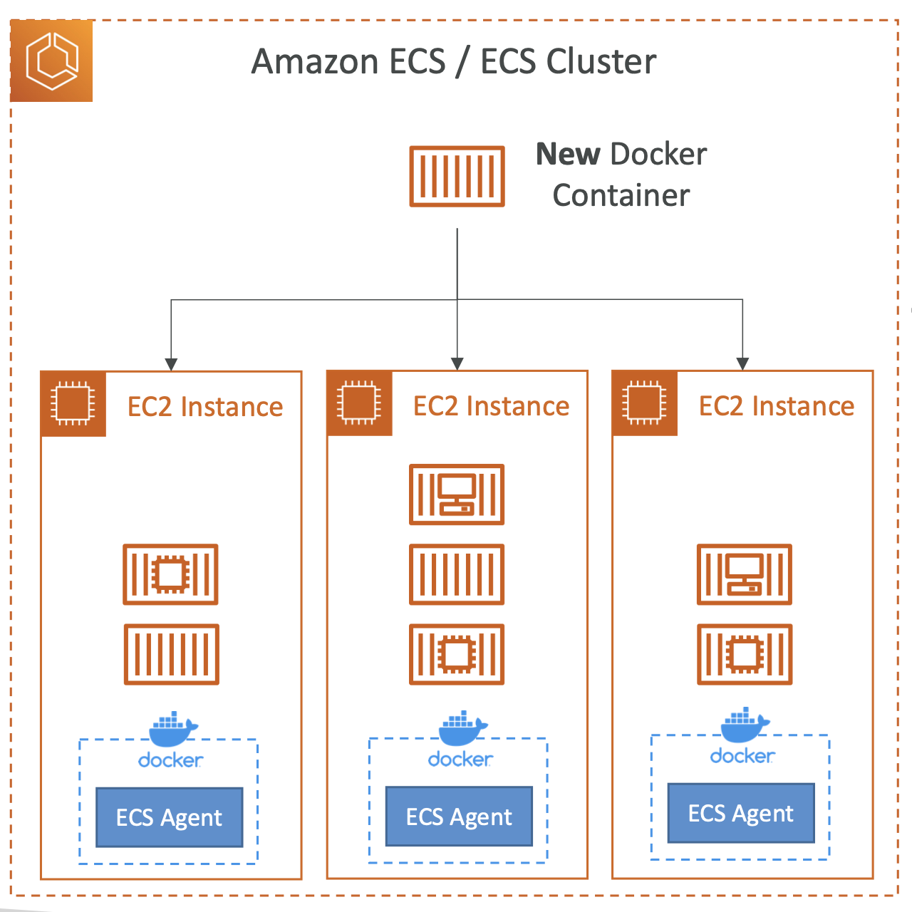
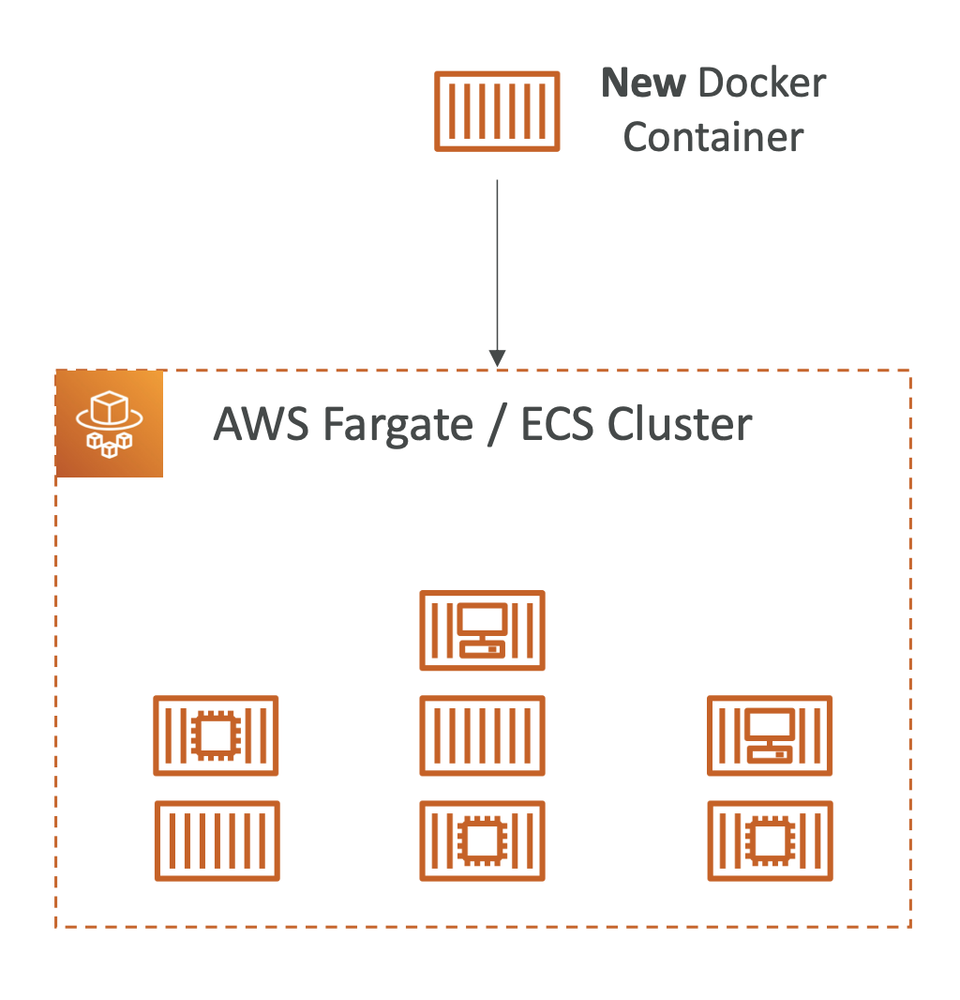

> ECS (Elastic Container Service) 는 도커를 활용한 컨테이너 환경의 어플리케이션을 더욱 편리하게 하는 서비스이다. ECS 를 사용하는 방법에는 다음 두 가지가 있다.\

### EC2 Instance 배포 방식

- 개념
  - 해당 방식에서는 사용자가 직접 EC2 인스턴스를 프로비저닝하고 관리해야 한다.
  - ECS 클러스터에서 사용할 EC2 인스턴스 내부에 ECS 에이전트를 설치하여 인스턴스가 ECS 클러스터의 일부가 되도록 한다.
  - 사용자가 띄우는 컨테이너는 해당 인스턴스 내부에서 관리된다.

- 특징
  - Container 를 띄울 EC2 를 직접 배포하여 관리하기 때문에 유연성은 높지만, 관리의 어려움이 있다.

### Fargate 방식

- 개념
  - 컨테이너를 관리할 서버를 사용자가 직접 관리하지 않는다.
  - 사용자는 컨테이너가 띄워질 서버를 몰라도 컨테이너를 배포 및 관리할 수 있다.
  - 즉, 컨테이너 관리를 위한 환경을 생각하지 않고 컨테이너만 관리하면 된다.

- 특징
  - 컨테이너가 필요로 하는 리소스를 직접 관리하지 않나도 되므로 EC2 를 직접 프로비저닝하는 방식보다 관리가 편하다.

---

### ECS 가 생겨난 이유?

> K8S 나 Docker 를 사용하면 되지 않는가? 그러나 Instance + Docker 만을 사용하기엔 배포하고자 하는 아키텍처가 너무 무겁고, K8S 를 사용하기엔 관리의 복잡성이 너무 큰 경우, 그 중간지점 쯤 되는 ECS 를 사용하는 것이 아닌가 싶다.

이와 관련한 사용사례
- https://aws.amazon.com/ko/solutions/case-studies/snoop-ecs-case-study/