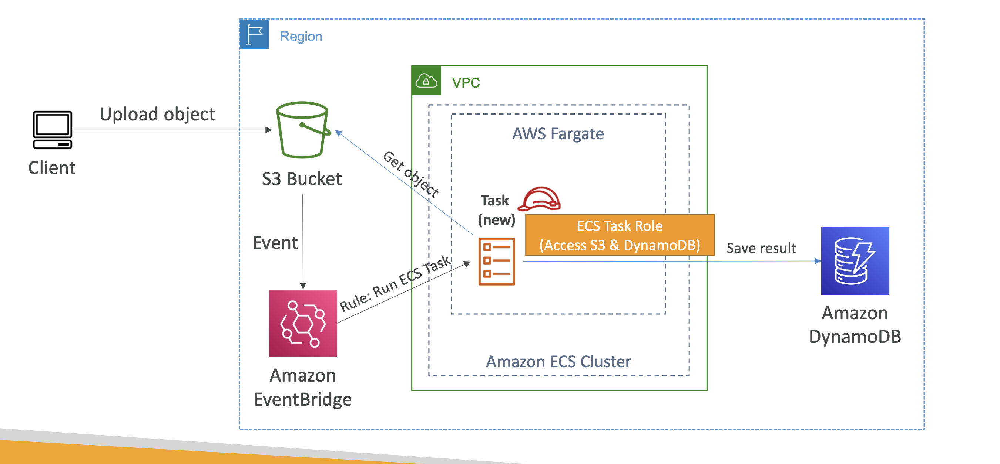
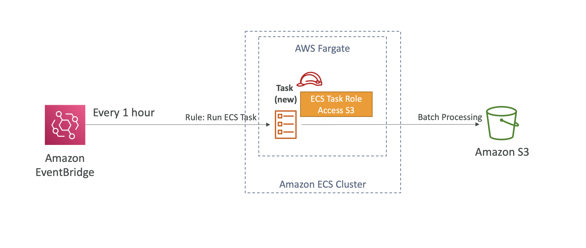
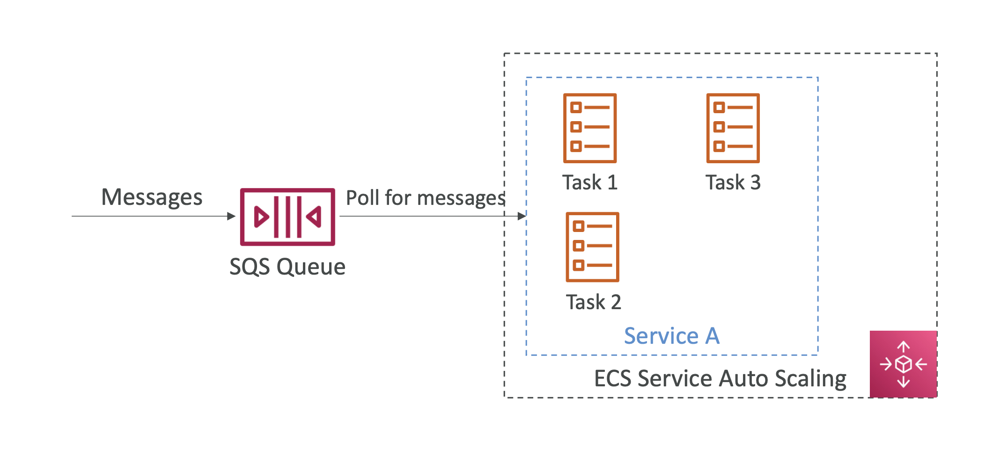

> ECS 에서의 Task 란, 컨테이너 인스턴스를 통해 수행하는 작업을 뜻한다. 즉 어떤 목적을 위해 실행되는 컨테이너를 Task 할 수 있으며, 해당 Task 에는 IAM role 을 부여하여 해당 권한을 기반으로 특정 작업을 수행할 수 있도록 할 수 있다.

- task 생성 시, 컨테이너가 사용할 자원, image 등을 선택하고 IAM role 을 부여하여(선택) 배포한다.
- 서비스는 지속적으로 실행되는 Task 들의 그룹을 말한다.

---
### Task 를 사용하는 아키텍처 예시

