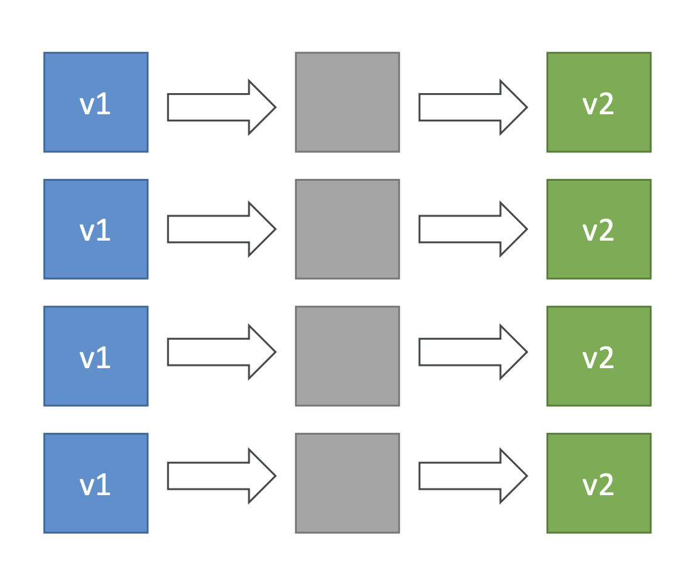
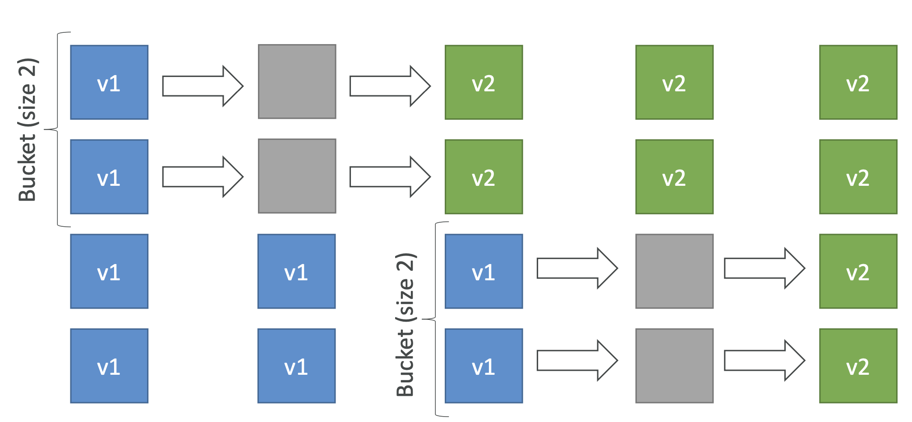
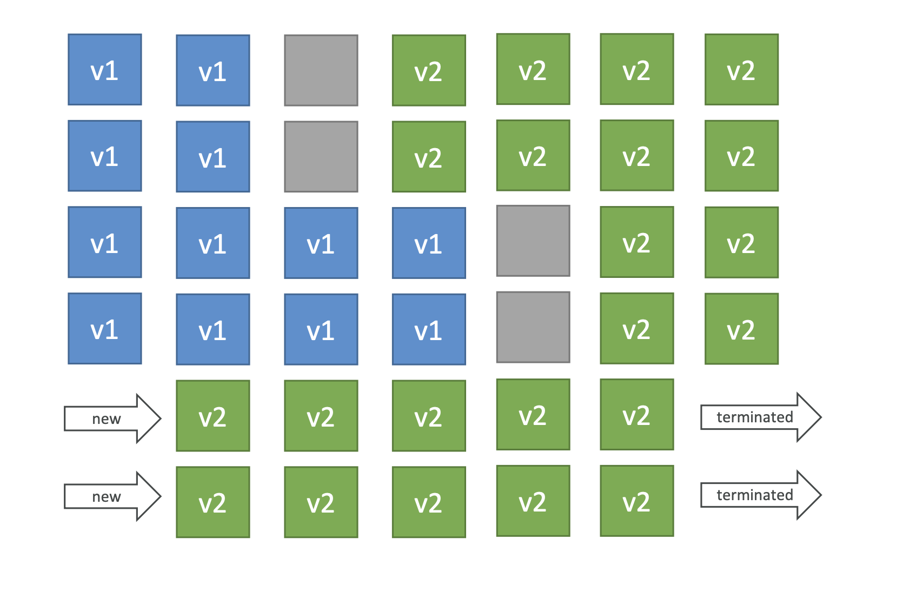
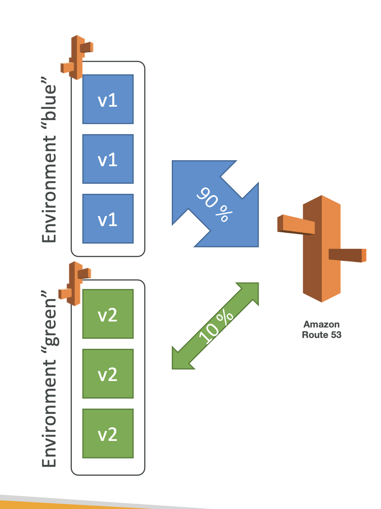
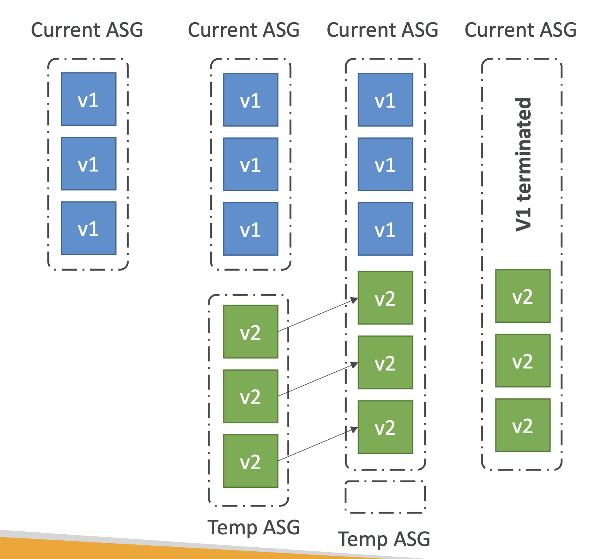
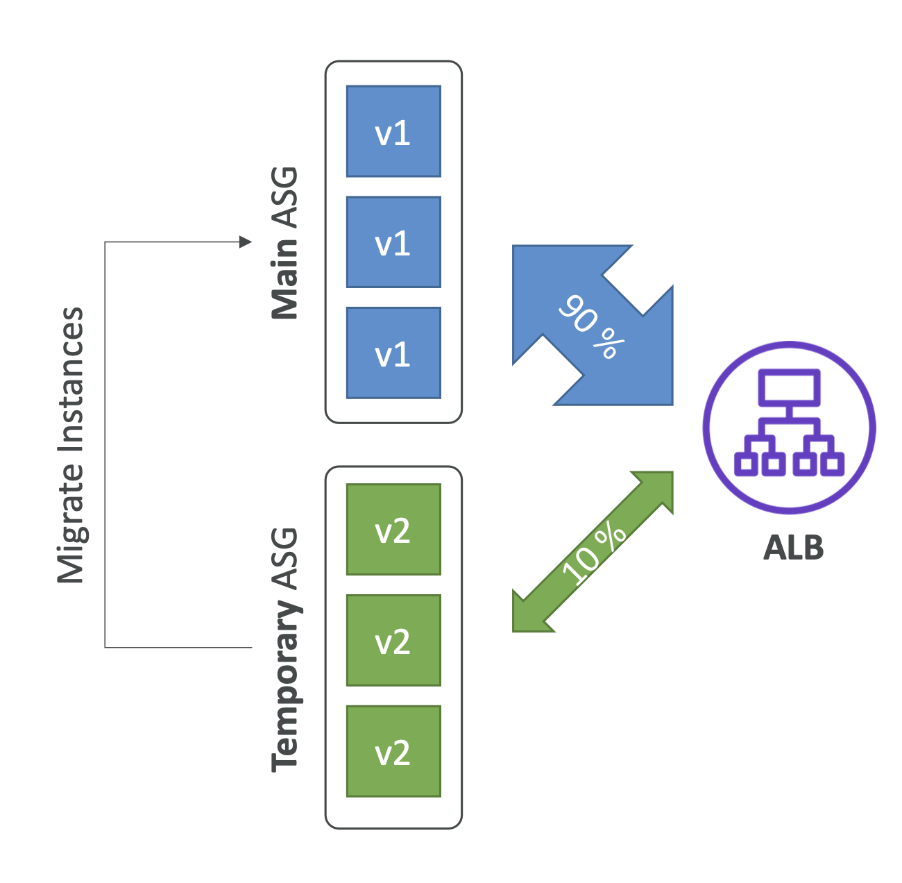

### 모든 인스턴스에서 한 번에 배포(All at Once)

   
- 한 번에 모든 인스턴스를 업데이트하기 때문에 모든 인스턴스를 빠르게 업데이트할 수 있다는 장점이 있으나, 업데이트 동안에는 서비스가 중단되므로 테스트 환경이나 가용성이 크게 중요하지 않은 개발 환경에서만 사용할 수 있다.

### 점진적 배포(Rolling)

- 특정 수의 인스턴스를 먼저 업데이트 한 뒤, 그 다음 인스턴스들을 업데이트하는 방식
- 고가용성이 보장된다는 장점이 있으나, 특정 인스턴스는 여전히 구버전의 서비스를 제공하므로 사용자별로 서비스 경험이 달라질 수 있다는 단점도 있음

### 점진적 배포 및 교체(Rolling with Additional Batch)

- 새로운 인스턴스를 추가하여 업데이트를 진행
- 기존의 인스턴스 수를 줄이지 않고도 업데이트를 진행하므로 고가용성을 극대화한다는 장점
- 인스턴스를 새로 생성해가며 업데이트하기 떄문에 비용이 추가로 발생한다는 단점

### 블루/그린 배포(Blue/Green Deployment)

- 새로운 버전을 별도의 환경에 배포한 뒤 새 환경에서 테스트가 완료되면 트래픽을 새로운 환경으로 전환한다.
- 무중단으로도 모든 인스턴스를 한 번에 업데이트할 수 있으며 새 버전을 철저하게 테스트할 수 있다는 장점이 있음
- 두 환경을 동시에 운영해야 하므로 비용이 증가한다는 단점이 있음

### 배치 업데이트(Batch)

- 전체 인스턴스를 그룹으로 나누어 각 그룹을 순차적으로 업데이트한다. 각 그룹의 업데이트가 완료되면 다음 그룹을 업데이트한다.
- 점진적 배포의 장점과 비슷하게 가용성을 유지할 수 있다.

### 장애 복구 배포(Immutable Deployment)

- 기존 인스턴스를 변경하지 않고, 새로운 ASG 그룹을 생성하고 인스턴스를 생성하여 배포한다. 새로운 인스턴스들이 배포완료되면 기존의 ASG 로 이동하고, 기존의 인스턴스를 삭제한다.
- 고가용성이 보장되며 배포 실패 시 롤백이 간단하다는 장점
- 새로운 인스턴스를 생성하는 비용이 추가된다는 단점.

### 트래픽 스플리팅(Traffic splitting)

- 카나리배포. 일부 트래픽을 새로운 버전의 인스턴스로 보낸다.
- 일부 트래픽을 업데이트된 서비스에 보냄으로써 일부 사용자의 요청에 대해 모니터링할 수 있고, 문제 발생 시 쉽게 롤백할 수 있다는 장점
- 지속적인 모니터링과 복잡한 설정이 필요하다는 단점