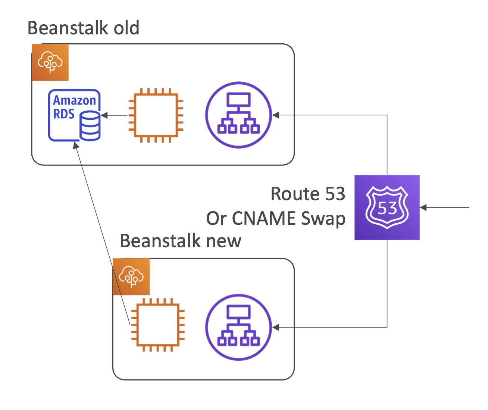

## 생명주기 관리

- EB 에 배포되는 어플리케이션에 대해 버전관리가 가능한데, 해당 어플리케이션의 버전에 대한 생명주기 관리가 가능하다.
- 두 가지 생명주기 관리 방법
  - 기간 설정 : 180 이상 된 버전은 삭제한다
  - 버전 개수 설정 : 버전을 200개까지만 관리한다. (200개가 채워지면 새로운 버전 배포 불가)

## EB 확장

- 이미 배포된 EB 구성에서 새로운 리소스를 추가할 수 있다.
- 코드 zip 파일 루트의 .ebextention 디렉토리 내 .config 확장자에 yaml 형식으로 구성을 추가하여 배포할 수 있다.

## 마이그레이션
> 일부 구성을 변경하여 새로운 EB 환경을 배포하고자 할 때의 전략
- 로드밸런서 변경
  - classic 로드 밸런서를 사용하고 있는 경우, alb 로 업그레이드를 직접 할 수 없다.
  - 이 경우, 기존의 EB 환경의 설정을 그대로 가져온 새로운 EB 를 배포하되, 로드밸런서 설정만 달리한다 (clb -> alb)
- RDS 는 그대로 유지하면서 EB 변경
  - 데이터베이스를 사용하는 EB 의 일부 구성을 변경하여 마이그레이션하고 싶은 경우가 있을 수 있다.
  - 이런 경우, RDS 의 삭제 보호 설정을 추가하고 새로운 EB 가 기존 RDS 를 바라보게 한 뒤 기존의 EB 를 삭제하면 RDS 만 남고 기존 EB 가 삭제되며 새로운 EB 는 여전히 기존의 RDS 를 바라볼 수 있다.
  - 