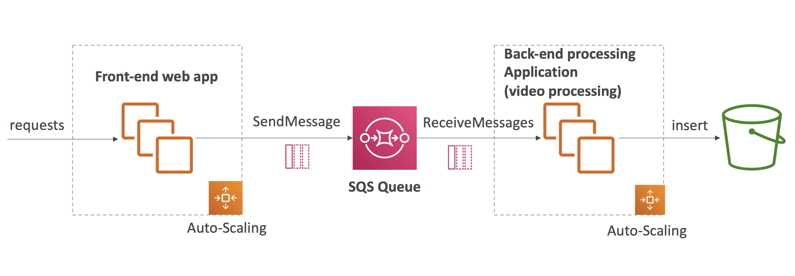
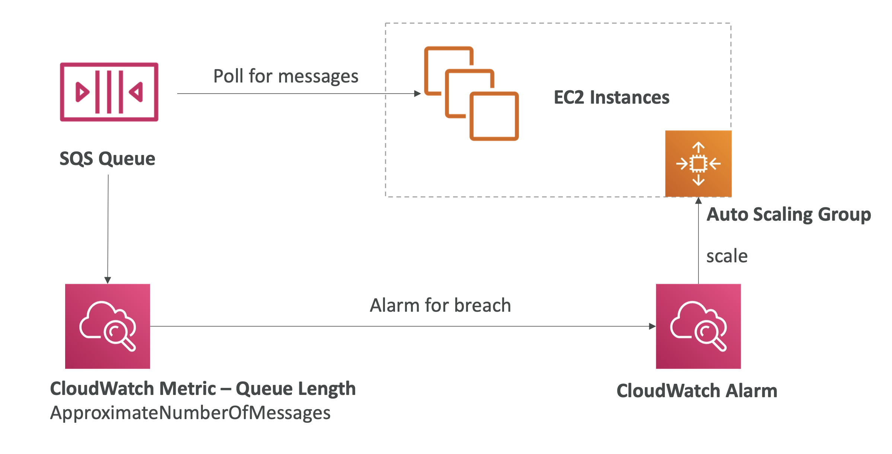

> Simple Queue Service (SQS)는 메시지 큐 서비스로서 애플리케이션 구성 요소 사이의 메시지를 송수신한다. 이는 분산 시스템이나 마이크로서비스 아키텍처에서 중요한 역할을 한다.

### 표준 큐 (Standard Queue)
- 초당 무제한 트랜잭션을 지원하여 많은 메시지를 빠르게 전송 및 처리할 수 있다.
- 메시지는 최소 한 번 이상 전달되지만, 중복 메시지가 발생할 수 있다.
- 순서가 보장되지 않음

### FIFO 큐 (First-In-First-Out Queue)
- 순서 보장: 메시지가 전송된 순서대로 정확히 한 번 전달된다.
- 중복된 메세지가 발생하지 않음
- 표준 큐에 비해 초당 처리할 수 있는 메시지 수가 제한되어 있음

### 주요 기능
- 메시지 지연 (Delay Queues): 메시지를 큐에 넣은 후 일정 시간이 지나야 소비자가 메시지를 받을 수 있도록 설정할 수 있다.
- 가시성 타임아웃 (Visibility Timeout): 메시지가 소비자에게 전달된 후 지정된 시간 내에 삭제되지 않으면 메시지가 다시 큐로 돌아와 다른 소비자에게 전달될 수 있다.
- 배치 처리 (Batch Processing): 여러 메시지를 한 번에 전송하거나 받는 기능을 제공한다. 이를 통해 성능을 최적화하고 네트워크 비용을 절감할 수 있다.
- 메시지 속성 (Message Attributes): 메시지에 메타데이터를 추가할 수 있다. 이는 메시지를 필터링하거나 추가 정보를 제공하는 데 유용하다.
- 데드 레터 큐 (Dead-Letter Queues): 일정 횟수 이상 처리되지 않은 메시지를 별도의 큐로 옮겨 관리할 수 있다. 이를 통해 문제 메시지를 추적하고 해결할 수 있다.

### 사용 사례
- 비동기처리: 웹 서버가 사용자 요청을 처리할 때, 시간 소요가 큰 작업을 비동기적으로 처리
- 분산 시스템: 서로 다른 서비스 간의 통신을 큐를 통해 비동기적으로 처리
  - 
- 이벤트 소싱: 이벤트 기반 아키텍처에서 이벤트를 큐에 저장하여 후속 처리 진행

### 통합
- SQS는 AWS의 다른 서비스와 쉽게 통합할 수 있다. 예를 들어, AWS Lambda와 통합하여 메시지가 큐에 도착할 때 자동으로 Lambda 함수를 실행할 수 있다. 또한, Amazon SNS와 결합하여 팬아웃 메시징 패턴을 구현할 수 있다.

- ASG 와 함꼐 사용하는 경우, message 가 급격히 증가하는 상황에 맞춰 EC2 인스턴스를 자동으로 스케일링 할 수 있다.
  - 
    
