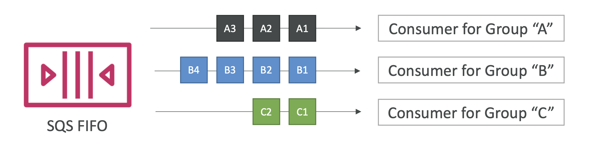

> 선입선출 방식의 queue. FIFO 방식 SQS 의 특징은 다음과 같다.

### 중복제거

- 5분 이내에 발생된 중복 메세지는 큐에 담기지 않는다.
- 메세지 중복을 판단하는 방식은 두 가지이다.
  - 본문 내용으로 판단 : 본문 내용을 특정 알고리즘으로 암호화하여 해시값을 비교
  - 중복 id 직접 입력 : 사용자가 queue 에 메세지를 보낼 때, 중복 id 를 설정할 수 있어 해당 id 가 두 번들어오면 중복으로 처리

### 메세지 그룹핑

- 특정 메세지들을 그룹핑(group id 지정)하여 특정 consumer 가 해당 메세지 그룹을 처리할 수 있도록 할 수 있다.
  - 