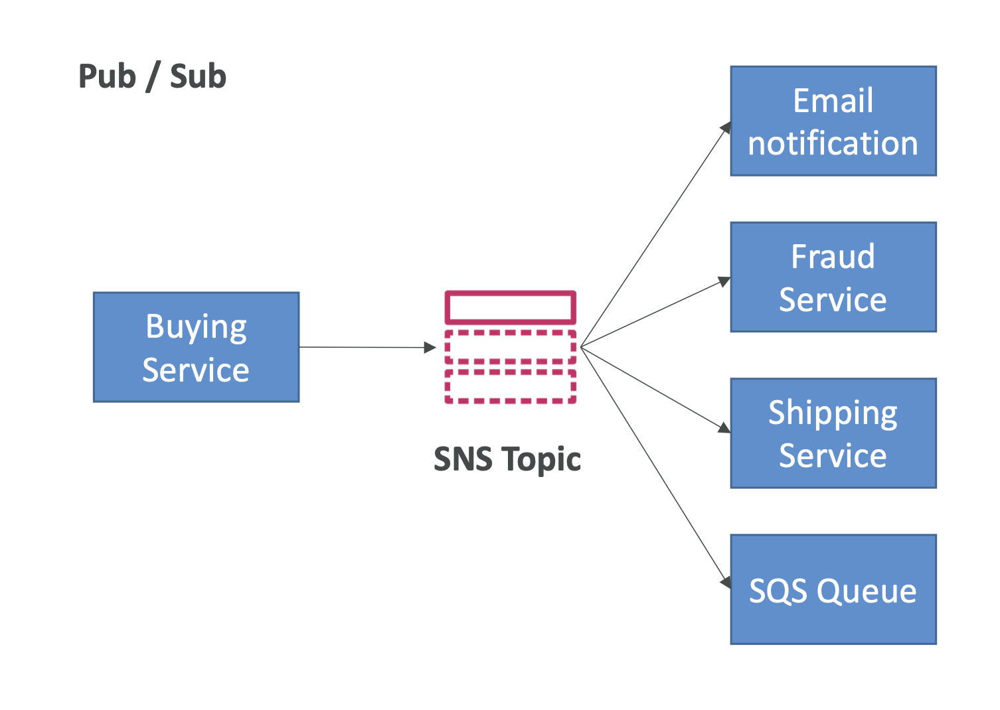

> Simple Notification Service (SNS)는 메시지 퍼블리싱/구독(pub/sub) 패턴을 기반으로 한 완전 관리형 메시징 서비스이다.

### pub/sub 모델

- 발행자(publisher)가 주제를 생성하고 메시지를 발행하면, 구독자(subscriber)가 해당 주제를 구독하여 메시지를 수신한다.
- 하나의 주제에 대해 여러 구독자가 있을 수 있다.

### SQS 와 비교

|특성	| Amazon SQS                                        | 	Amazon SNS|
|--|---------------------------------------------------|--|
|메시징 모델| 	Point-to-Point (P2P)|	Publish/Subscribe (Pub/Sub) |
|메시지 전달|	한 소비자에게 한 번 전달|	여러 구독자에게 동시에 전달|
|목적|	비동기 작업 큐잉	|실시간 알림 및 방송|
|메시지 보존 기간|	최대 14일	|실시간 전달 (보존 없음)|
|다양한 프로토콜|	지원하지 않음	|HTTP/HTTPS, Email, SMS, Lambda, SQS 등|
|중복 메시지|	가능	|없음 (각 구독자에게 한 번씩 전달)|
|사용 사례|	비동기 처리, 작업 대기열	|시스템 알림, 이벤트 방송|