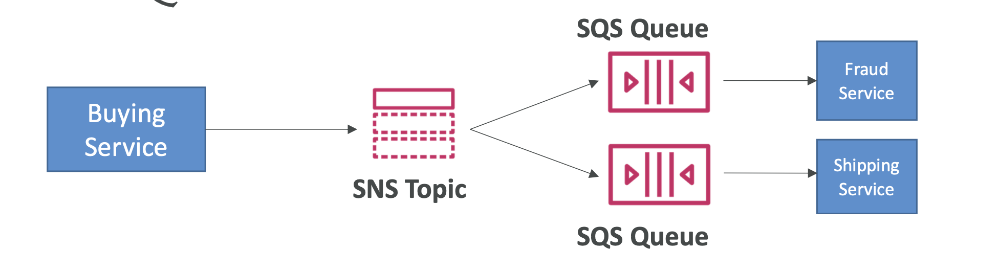
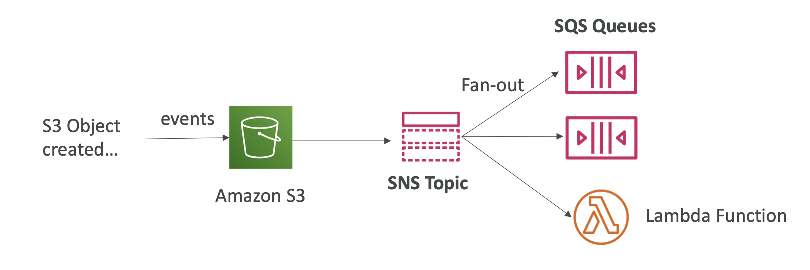
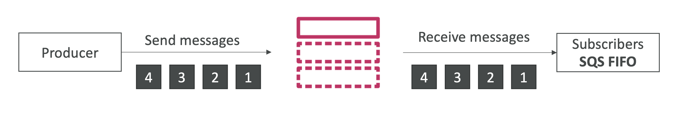
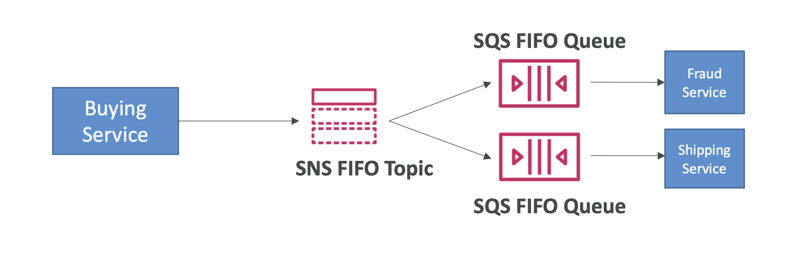
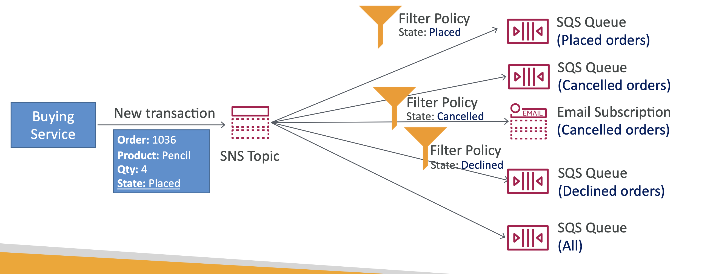

> Fan Out 패턴은 SNS 와 SQS 를 결합하여 pub/sub 방식과 메세지 큐잉을 함께 처리할 수 있도록 하는 아키텍처이다.

- 아키텍처
    - 
- 예시
  - 

### FIFO
- FIFO 토픽과 FIFO SQS 를 이용하여 순서와 중복제거를 보장할 수 있다.
  -   
  - 

### Filtering
- 구독한 주제의 이벤트 중 특정 이벤트만 걸러서 알람을 받을 수 있다. (json 으로 필터링 정책 설정)
  - 