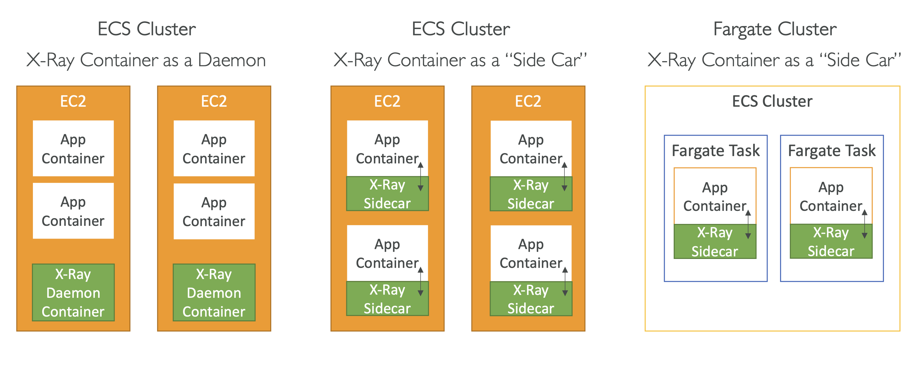

> X-Ray 는 분산 애플리케이션의 문제를 진단하고 성능을 분석할 수 있도록 돕는 서비스이다. X-Ray 는 애플리케이션의 요청 데이터를 수집하고 이를 시각화하여 개발자가 애플리케이션의 성능 문제를 식별하고 해결하는 데 도움을 준다.

## 주요 기능

### 추적 데이터 수집

- 애플리케이션에서 발생하는 요청을 추적하여 각 요청의 시작부터 끝까지의 흐름을 기록한다. 이를 통해 애플리케이션의 각 구성 요소가 어떻게 상호작용하는지 파악할 수 있다.

### 세그먼트 및 하위 세그먼트

- 요청은 세그먼트와 하위 세그먼트로 나뉜다. 세그먼트는 전체 요청을 나타내고, 하위 세그먼트는 해당 요청 내에서 개별 작업을 나타낸다. 이를 통해 요청의 세부적인 수행 단계를 분석할 수 있다.

### 서비스 맵

- 애플리케이션의 서비스 맵을 생성하여 각 서비스 간의 상호작용을 시각적으로 표시한다. 서비스 맵을 통해 각 서비스의 상태와 성능을 한눈에 파악할 수 있다.

### 오류 및 예외 추적

- 애플리케이션에서 발생하는 오류와 예외를 추적하여 문제가 발생한 위치와 원인을 식별할 수 있다.

### 트랜잭션 샘플링

- 추적할 요청의 비율을 설정하여, 모든 요청을 추적하지 않으면서도 충분한 정보를 수집하여 애플리케이션의 성능을 모니터링할 수 있도록 한다.
- 샘플링을 사용하면 트래픽이 많은 애플리케이션에서 X-Ray 가 수집하는 데이터의 양을 줄여 성능 오버헤드를 최소화할 수 있다.
- 샘플링 규칙을 통해 어떤 요청을 추적할지 결정한다.
  - 우선순위(Priority): 규칙의 평가 순서를 결정
  - 조건(Condition): URL 경로, HTTP 메서드, 서비스 이름 등 조건을 지정
  - 고정 비율(Fixed Rate): 지정된 비율에 따라 무조건 추적하는 요청의 비율
  - 할당량(Requests per Second): 초당 추적할 최대 요청 수

## 작동 방식

### 애플리케이션 통합

- X-Ray SDK 를 사용하여 애플리케이션에 통합한다. SDK 는 각 요청을 추적하고 데이터를 수집한다.
- SDK 를 통해 관련 코드를 직접 소스에 포함하면 어플리케이션 코드가 복잡해지므로, 직접 코드를 주가하지 않고 JVM 내에서 동작하는 X-Ray 에이전트를 사용하거나, Beanstalk 혹은 ECS 를 이용하여 어플리케이션에 대한 X-Ray 모니터링을 활성화할 수 있다.
  - 

### 데이터 수집 및 전송

- SDK 는 수집된 데이터를 X-Ray 데몬(X-Ray Daemon)으로 전송한다. X-Ray Daemon 은 데이터를 X-Ray 서비스로 전송하여 분석한다.

### 데이터 분석 및 시각화

- X-Ray 서비스는 수집된 데이터를 분석하여 서비스 맵, 추적 세부 정보, 오류 및 예외 등을 시각화한다.