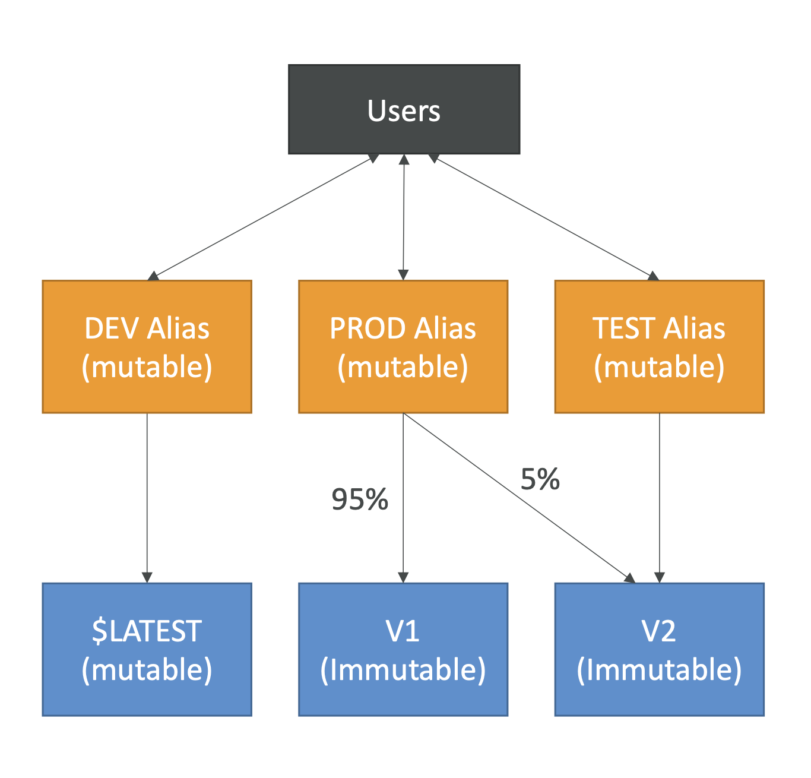

> Lambda Alias 는 특정 Lambda 함수 버전에 대해 별칭을 부여하는 기능이다. 이를 통해 함수 버전을 쉽게 관리하고, 애플리케이션을 배포할 때 특정 버전의 함수로 트래픽을 라우팅할 수 있다. 람다에서는 **가중치**라는 개념을 통해 트래픽 제어

### 버전 관리

- Lambda 함수의 특정 버전을 지정된 이름(Alias)으로 참조할 수 있다. 예를 들어, "prod", "test", "dev"와 같은 Alias 를 생성하고 각 Alias 가 서로 다른 함수 버전을 참조하도록 한다.

### 배포 및 롤백

- 새로운 버전을 배포할 때 Alias 를 사용하여 쉽게 전환할 수 있다. 예를 들어, "prod" Alias 를 최신 버전의 함수를 바라보도록 업데이트하면, 해당 Alias 를 참조하는 모든 호출이 새로운 버전으로 라우팅된다. 문제가 발생하면 이전 버전으로 롤백하는 것도 간단하다.

### 트래픽 라우팅

- Alias 는 트래픽을 여러 버전의 Lambda 함수로 분할하여 라우팅할 수 있으며, 이를 통해 점진적 배포(예: Canary 배포)를 수행할 수 있다. 예를 들어, Prod Alias 가 받는 90%의 트래픽을 V1으로, 10%의 트래픽을 V2로 라우팅하여 V2 가 완전 배포되기 위한 Canary 배포를 수행할 수 있다.

---

> Lambda 함수는 기본적으로 $LATEST 라는 최신 버전을 가지고 있다. 각 배포 시마다 새로운 버전 번호(정수)를 생성할 수 있다.