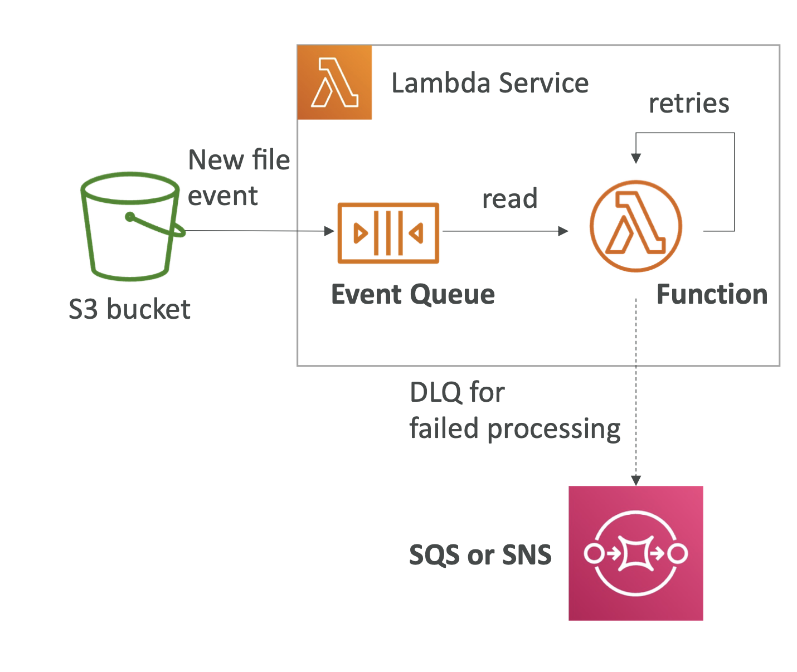

## Lambda를 비동기로 호출하는 이유

### 백그라운드 작업 처리

- 비동기 호출을 통해 백그라운드에서 작업을 처리할 수 있다. 예를 들어, 이미지 처리, 데이터 분석, 파일 변환 등의 작업을 비동기로 처리하여 사용자 경험을 향상시킬 수 있다.

### 높은 처리량

- 비동기 호출을 사용하면 동시에 많은 요청을 처리할 수 있다. Lambda는 이러한 요청을 병렬로 처리하여 높은 처리량을 달성할 수 있다.

### 재시도 메커니즘:

- Lambda 는 비동기 호출에 대해 내장된 재시도 메커니즘을 제공한다. 함수가 실패할 경우, 자동으로 재시도를 수행하여 일시적인 오류를 처리할 수 있다.
- 반복해서 실패되는 이벤트에 대해서는 DLQ 를 구현하여 이후 처리되도록 한다.
  - 

## Lambda 비동기 호출이 필요한 상황

### 이미지 업로드 및 처리
- 사용자가 웹 애플리케이션에 이미지를 업로드하면, 이미지를 리사이징하고 다양한 형식으로 변환해야 한다. 이 작업은 시간이 걸리기 때문에 비동기로 처리하여 사용자에게 빠른 응답을 제공하고자 한다.

### 데이터 분석 및 보고서 생성
- 사용자가 데이터를 업로드하면, 데이터 분석을 수행하고 결과 보고서를 생성해야 한다. 데이터 분석은 시간이 걸리는 작업이므로, 비동기로 처리한다.