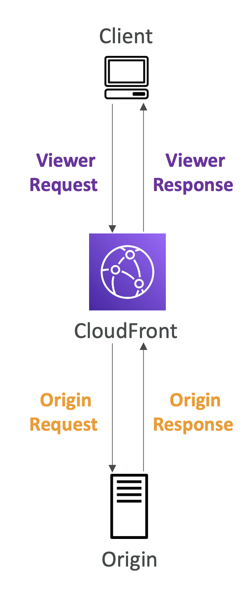

> Lambda@Edge는 Lambda 와 Amazon CloudFront 의 글로벌 네트워크를 통합한 기능이다. 이를 통해 전 세계적으로 분산된 클라우드 인프라(앳지)마다 Lambda 를 배치시켜 엣지별로 클라이언트의 요청 및 서버의 응답을 수정할 수 있도록 한다.

## Lambda@Edge 사용 사례

### HTTP 헤더 수정

- CloudFront 를 통해 전달되는 HTTP 요청 및 응답 헤더를 수정할 수 있다. 예를 들어, 보안 헤더 추가, 사용자 정의 헤더 추가 등이 가능하다.

### 사용자 맞춤형 콘텐츠 제공

- 사용자 위치, 디바이스 유형, 쿠키 등의 정보를 기반으로 맞춤형 콘텐츠를 제공할 수 있다. 예를 들어, 지역별로 다른 언어의 콘텐츠를 제공하거나, 모바일과 데스크탑 사용자에게 다른 콘텐츠를 제공할 수 있다.

### A/B 테스트 및 기능 플래그

- 다양한 사용자 그룹에 대해 다른 버전의 콘텐츠를 제공하여 A/B 테스트를 수행하거나, 특정 기능을 점진적으로 롤아웃할 수 있다.

### 실시간 이미지 처리

- 사용자의 요청에 따라 이미지를 실시간으로 리사이징하거나 변환할 수 있다. 이를 통해 다양한 디바이스와 화면 크기에 적합한 이미지를 제공할 수 있다.

