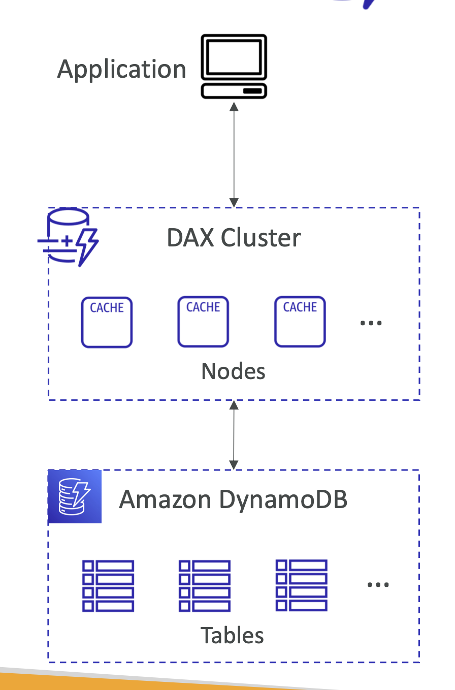

> **DAX (DynamoDB Accelerator)** 는 DynamoDB의 인메모리 캐시 서비스로, DynamoDB 테이블에 대한 읽기 성능을 대폭 향상시킬 수 있도록 설계되었다. DAX는 DynamoDB와 완벽하게 통합되어, 애플리케이션이 변경 없이 캐시된 데이터를 활용할 수 있게 해준다.

### 인메모리 캐싱
   - 데이터 캐싱: DAX는 DynamoDB 테이블의 데이터를 인메모리에 캐싱한다. 이를 통해 DynamoDB에 직접 접근하는 것보다 훨씬 빠른 데이터 읽기를 제공한다.
   - 저지연 읽기: DAX는 마이크로초 단위의 응답 시간을 목표로 하여, 고성능 애플리케이션에서 데이터 읽기 성능을 최적화한다.
2) 완전 관리형 서비스
   - AWS 관리: DAX는 AWS에서 완전 관리형으로 제공되므로, 사용자는 캐시 클러스터의 프로비저닝, 패치 관리, 복구 등을 직접 관리할 필요가 없다.
   - 자동 확장: DAX 클러스터는 자동으로 확장할 수 있으며, 필요에 따라 노드를 추가하여 성능을 조정할 수 있다.
3) DynamoDB와의 호환성
   - API 호환성: DAX는 DynamoDB API와 호환되므로, 애플리케이션에서 DAX를 사용하기 위해 코드 변경이 거의 필요하지 않다. DynamoDB 클라이언트 대신 DAX 클라이언트를 사용하는 것으로 충분하다.
   - 일관성 지원: DAX는 기본적으로 최종적 일관성(Eventually Consistent Reads)을 제공하지만, 필요에 따라 강력한 일관성(Strongly Consistent Reads)을 사용할 수 있다. 다만, 강력한 일관성 읽기는 캐시를 우회하여 DynamoDB에서 직접 데이터를 가져온다.