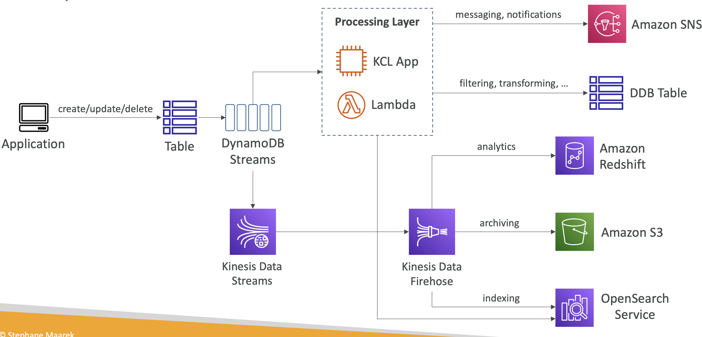

> DynamoDB Streams 는 DynamoDB 테이블에서 발생하는 데이터 변경 사항(즉, 삽입, 업데이트, 삭제)에 대한 시계열(chronological) 기록을 캡처하고 이를 다른 AWS 서비스나 애플리케이션에서 처리할 수 있도록 스트림으로 제공한다. DynamoDB Streams 는 데이터 변경 사항에 대한 실시간 처리 및 분석, 데이터 복제, 트리거 실행 등을 가능하게 해준다.

### 1. DynamoDB Streams의 주요 개념

#### 1) 스트림 레코드(Stream Record)
- **정의**: DynamoDB Streams는 테이블에서 발생한 모든 데이터 변경 사항에 대한 기록을 **스트림 레코드** 형태로 저장한다. 각 스트림 레코드는 변경된 아이템의 데이터를 포함한다.
- **형태**: 각 스트림 레코드는 변경 유형(삽입, 업데이트, 삭제), 이전 데이터 이미지(이전 상태), 새로운 데이터 이미지(변경 후 상태) 등을 포함할 수 있다.
- **레코드 구성 요소**
    - **EventName**: `INSERT`, `MODIFY`, `REMOVE` 중 하나로, 데이터가 삽입, 수정, 삭제 중 어떤 작업이 수행되었는지를 나타낸다.
    - **Keys**: 변경된 항목의 주 키(Primary Key)를 나타낸다.
    - **NewImage**: 변경 후의 새로운 데이터 상태를 포함한다.
    - **OldImage**: 변경 전의 기존 데이터 상태를 포함한다.

#### 2) 스트림 보기 유형(Stream View Type)
- **Keys only**: 주 키(Primary Key) 정보만 포함하는 스트림 레코드를 생성한다. 변경된 항목의 기본 키만 기록되며, 데이터 내용은 포함되지 않는다.
- **New image**: 변경된 데이터의 새로운 상태만 포함한다. 즉, 업데이트나 삽입 후의 데이터만 기록된다.
- **Old image**: 변경되기 전의 데이터 상태만 포함한다. 즉, 업데이트되기 전이나 삭제되기 전의 데이터를 기록한다.
- **New and old images**: 변경 전과 후의 모든 데이터를 포함한다. 즉, 업데이트된 데이터의 이전 상태와 새로운 상태를 모두 기록한다.

#### 3) 스트림 지속 시간
- 스트림 레코드는 DynamoDB Streams에서 최대 **24시간** 동안 유지된다. 이 기간 내에 레코드를 처리해야 하며, 그 이후에는 레코드가 자동으로 삭제된다.

### 2. DynamoDB Streams의 주요 사용 사례

#### 1) 실시간 데이터 처리
- DynamoDB Streams를 사용하여 테이블에서 발생하는 데이터 변경 사항을 실시간으로 처리할 수 있다. 예를 들어, 새로운 주문이 생성될 때마다 주문 정보를 실시간으로 처리하는 애플리케이션을 구축할 수 있다.

#### 2) 트리거 실행 (Lambda 연동)
- AWS Lambda와 연동하여 DynamoDB 테이블에서 발생하는 데이터 변경 이벤트에 대해 자동으로 Lambda 함수를 실행할 수 있다. 이를 통해 자동화된 처리 로직을 구현할 수 있다. 예를 들어, 테이블에 새로운 데이터가 삽입될 때 이를 처리하는 Lambda 함수를 트리거로 실행할 수 있다.

#### 3) 데이터 복제 및 동기화
- DynamoDB Streams를 사용하여 두 개의 DynamoDB 테이블 간에 데이터를 복제하거나 동기화할 수 있다. 이를 통해 멀티 리전 복제나 백업 시스템을 쉽게 구축할 수 있다.

#### 4) 변경 로그 감사
- 데이터 변경 내역을 기록하고 감사(audit)할 수 있다. DynamoDB Streams를 사용하면 테이블에서 발생한 모든 변경 사항을 추적하여 데이터의 변경 이력을 관리할 수 있다.

### 4. DynamoDB Streams + AWS Services

#### 1) AWS Lambda와의 통합
- DynamoDB Streams와 AWS Lambda를 연동하면, 데이터베이스에서 발생하는 변경 사항에 따라 Lambda 함수를 자동으로 트리거할 수 있다.

#### 2) Kinesis Data Streams와의 통합
- DynamoDB Streams 데이터를 Kinesis Data Streams로 전송하여 실시간 데이터 분석 및 복잡한 스트림 처리 파이프라인을 구성할 수 있다.
