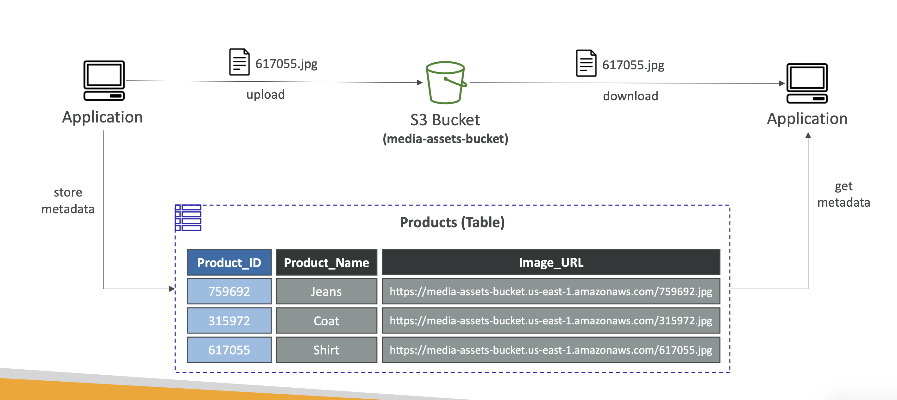
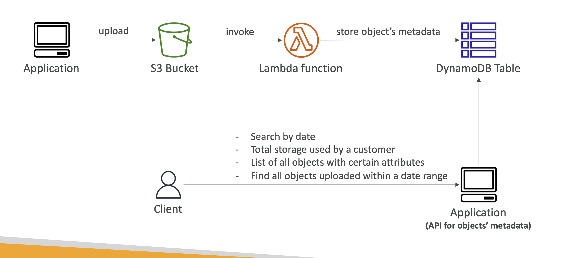

> Dynamo DB 와 S3 를 결합하여 두 가지 전략 구현이 가능하다.

### 1. Large Object Pattern

- Dynamo DB 는 하나의 데이터 row 당 최대 400KB 의 정보를 저장할 수 있다.
- 따라서 용량이 큰 이미지나 비디오를 저장하기에 어려움이 있는데, S3 를 이용하여 원본 데이터는 버킷에 저장하고 해당 데이터를 바라보는 URL 을 DynamoDB 에 저장함으로써 데이터를 가져올 수 있도록 한다.

### 2. Indexing S3 Object Metadata

- S3 에 저장된 데이터를 탐색하기 쉽지 않다.
- S3 에 저장된 객체들에 대한 metadata(이름, insert 날짜 등) 를 dynamoDB에 저장함으로써 해당 DB 에서 정렬, 조건 검색 등 탐색을 쉽도록 함 