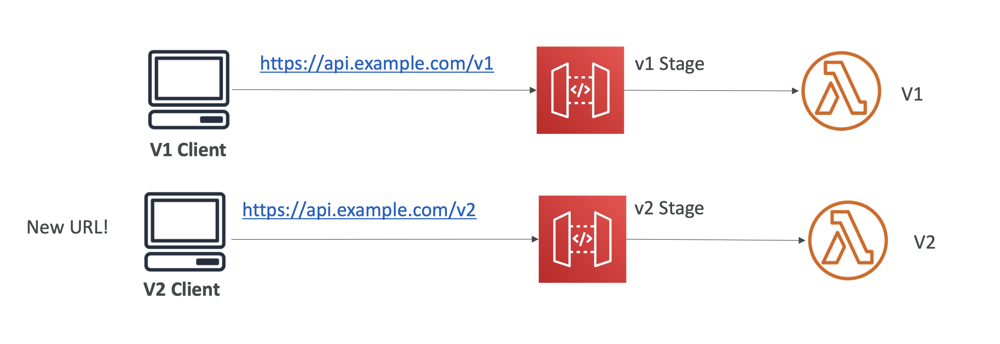

> API Gateway에서는 각 API에 대해 버전을 지정할 수 있고, 이를 통해 동일한 API의 여러 버전을 동시에 관리하고 배포할 수 있다.

### 스테이지(stage)를 사용한 버전 관리
- API Gateway에서는 `스테이지`라는 개념을 사용해 API의 버전을 관리한다. 각 스테이지는 API의 특정 배포 상태를 나타내며, 예를 들어 dev, test, prod 등의 이름으로 나누어 운영할 수 있다. 각 스테이지는 고유한 URL 엔드포인트를 가지며, 이를 통해 다양한 버전의 API를 분리하여 관리할 수 있다.

### 버전 파라미터 또는 경로 변수 사용
- API 경로에 버전 번호를 포함시켜 각 버전의 API를 제공할 수 있다. 예를 들어, /v1/users와 /v2/users와 같이 경로에 버전 번호를 넣어 API를 구분할 수 있다. 이렇게 하면 클라이언트가 특정 버전을 명시적으로 요청할 수 있다.

### API 복제 및 새로운 버전 배포
- API Gateway에서는 기존 API를 복제하여 새로운 버전을 생성할 수 있다. 그런 다음 새로운 기능을 추가하거나 변경한 뒤, 이 새로운 버전을 별도의 스테이지로 배포할 수 있다.

