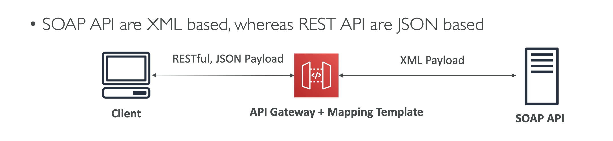
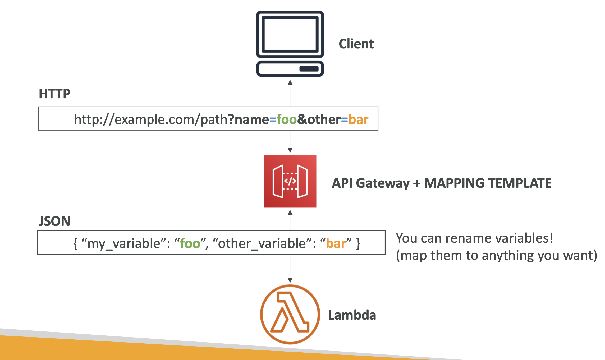

> Mapping Template은 클라이언트로부터 받은 요청 데이터를 백엔드로 전달하기 전에 변환하거나, 백엔드에서 반환된 응답 데이터를 클라이언트에게 전달하기 전에 변환하는 데 사용되는 도구이다. Mapping Template은 주로 VTL(Velocity Template Language)을 사용하여 작성되며, API Gateway가 요청 또는 응답의 형식을 유연하게 변경할 수 있게 해준다.

## 주요 기능 및 역할
### 요청 변환(Request Mapping)
- 클라이언트로부터 받은 HTTP 요청 데이터를 원하는 형식으로 변환하여 백엔드 서비스로 전달할 수 있다. 예를 들어, 클라이언트가 보내는 JSON 데이터를 특정 형식의 XML로 변환하여 백엔드로 전달할 수 있다.
- 예시
  - 클라이언트가 보낸 JSON 데이터를 Lambda 함수가 처리할 수 있는 형식으로 변경.
  - HTTP 쿼리 파라미터나 헤더 값을 백엔드 서비스가 필요로 하는 특정 형식으로 매핑.

### 응답 변환(Response Mapping)

- 백엔드 서비스로부터 반환된 응답 데이터를 클라이언트에게 전달하기 전에 원하는 형식으로 변환할 수 있다. 예를 들어, 백엔드에서 반환된 XML 응답을 JSON 형식으로 변환하여 클라이언트에게 전달할 수 있다.
- 예시
  - Lambda 함수가 반환한 응답을 클라이언트의 요구 사항에 맞게 수정하여 전달.
  - 백엔드 서비스의 응답에서 불필요한 데이터 제거 또는 추가적인 정보를 포함시켜 클라이언트에게 전달.

### 복잡한 데이터 변환 및 처리

- Mapping Template을 사용하면 단순한 값 치환 이상의 복잡한 데이터 변환 및 로직을 처리할 수 있다. 예를 들어, 조건부로 데이터를 변경하거나, 반복문을 통해 배열을 처리할 수 있다.
- 예시
  - 여러 필드를 조합해 새로운 JSON 구조 생성.
  - 특정 조건에 따라 응답 메시지의 구조를 다르게 반환.

### Mocking Test
- 여러 가지 응답을 설정하여 백엔드 없이 테스트를 진행할 때 사용할 수 있다.

