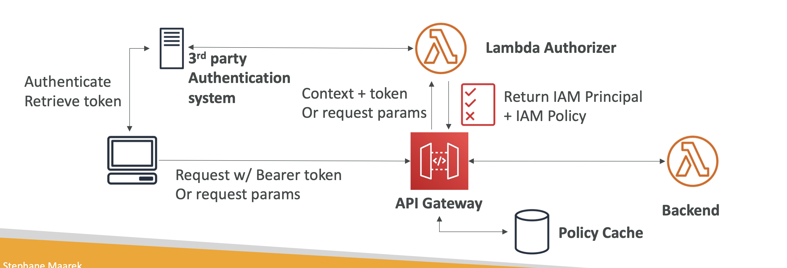

### API Gateway에 대한 접근 권한 세 가지 종류

> API Gateway에서 API에 대한 접근 권한을 제어하기 위해  **IAM 권한**, **Amazon Cognito**, **Lambda Authorizer** 세 가지 주요 방법이 있다. 각 접근 권한 방식은 서로 다른 보안 요구사항을 충족시키며, 특정 상황에 맞게 선택할 수 있다.

### 1. IAM 권한 (IAM Permissions)

**IAM (Identity and Access Management)** 은 AWS 리소스에 대한 접근을 관리하는 서비스다. IAM 권한을 사용하여 API Gateway에 대한 접근을 제어할 수 있다.

- **특징**: IAM 정책을 통해 API에 접근할 수 있는 사용자를 제어할 수 있다. API Gateway와 IAM은 AWS의 보안 모델을 따르기 때문에, API에 접근하려는 사용자나 서비스는 적절한 IAM 역할(Role)이나 사용자(User) 권한을 가져야 한다.

- **사용 예시**: 주로 내부 애플리케이션, 서버 간의 통신, 또는 AWS 내에서 운영되는 서비스가 API를 호출할 때 사용된다. 예를 들어, Lambda 함수가 특정 API를 호출할 때 IAM 역할을 통해 권한을 부여할 수 있다.

### 2. Amazon Cognito

**Amazon Cognito**는 사용자를 인증하고, 임시 보안 자격 증명을 제공하는 AWS의 사용자 관리 서비스다. Cognito를 사용하여 API Gateway에 대한 접근을 제어할 수 있다.

- **특징**: Cognito는 사용자 풀(User Pool)을 통해 사용자를 인증하고, 권한 부여 그룹(Group) 및 정책을 통해 API에 대한 접근 권한을 관리한다. 인증된 사용자에게는 임시 보안 자격 증명이나 ID 토큰이 부여되며, 이를 통해 API에 접근할 수 있다.

- **사용 예시**: 웹 및 모바일 애플리케이션에서 최종 사용자에게 인증 및 권한 부여를 제공할 때 주로 사용된다. 예를 들어, 모바일 앱 사용자가 로그인한 후 특정 API에 접근할 때 Cognito를 통해 인증을 관리할 수 있다.

### 3. Lambda Authorizer

**Lambda Authorizer**는 사용자 정의 Lambda 함수를 사용하여 API Gateway의 API 호출을 인증하고 권한을 부여하는 방법이다.

- **특징**: Lambda Authorizer는 API 호출 시마다 트리거되며, 사용자 정의 로직을 통해 토큰이나 요청 매개변수를 검증한다. 검증 후, 적절한 IAM 정책을 동적으로 생성하여 API 호출을 허용하거나 거부할 수 있다.
  
- **사용 예시**: 복잡한 인증 및 권한 부여 로직이 필요한 경우에 사용된다. 예를 들어, API 호출자가 특정 JWT 토큰을 제공해야 하거나, IP 주소, 사용자 역할 등에 기반하여 접근을 제어해야 하는 경우 Lambda Authorizer를 사용할 수 있다.
