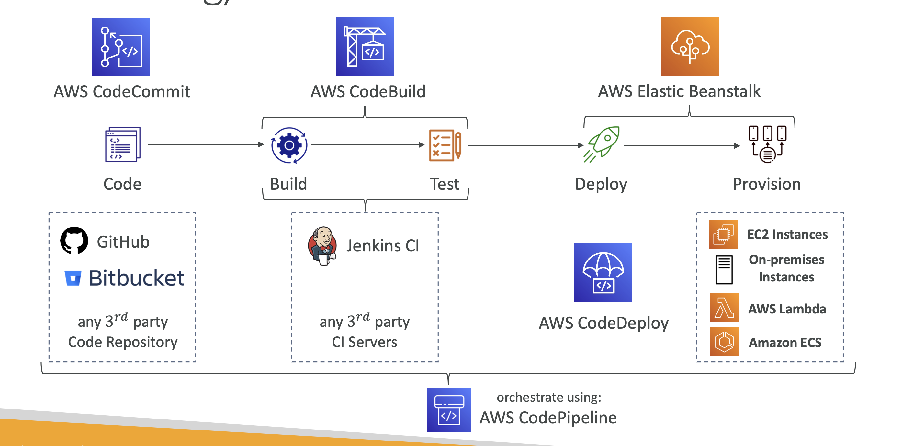

### AWS CI/CD 

> **CI/CD(Continuous Integration and Continuous Delivery/Deployment)** 는 애플리케이션 개발, 테스트, 배포 과정을 자동화하여 소프트웨어 개발의 효율성을 높이는 데 중점을 둔 방법론이다. CI/CD 를 이용하면 소프트웨어 개발 및 배포 프로세스를 자동화하여 빠르고 안정적인 애플리케이션 배포를 실현할 수 있다. 이를 통해 개발 주기가 단축되고, 애플리케이션의 품질이 향상되며, 시장 출시 시간이 줄어든다.  AWS는 이러한 CI/CD 파이프라인을 구축하고 운영할 수 있는 다양한 서비스를 제공하며, 이를 통해 개발팀은 더욱 빠르고 안정적으로 애플리케이션을 개발하고 배포할 수 있다.

### AWS CI/CD 서비스 개요

> AWS에서는 CI/CD를 지원하기 위해 다양한 서비스가 제공되며, 각 서비스는 소프트웨어 개발의 특정 단계에 맞춰 사용된다. 주요 서비스는 다음과 같다.

1. **CodeCommit**: 소스 코드 관리
2. **CodeBuild**: 빌드 및 테스트
3. **CodeDeploy**: 애플리케이션 배포
4. **CodePipeline**: CI/CD 파이프라인 오케스트레이션
5. **CodeArtifact**: 패키지 관리
6. **CodeStar**: CI/CD 프로젝트 관리

### 주요 서비스 및 기능

#### 1. AWS CodeCommit

- **역할**: AWS CodeCommit은 Git 호환 코드 리포지토리 서비스로, 소스 코드, 바이너리 파일, 환경 설정 등을 안전하게 저장하고 관리할 수 있다.
- **특징**:
    - Git과 완벽하게 호환되므로 기존 Git 클라이언트와 통합이 가능하다.
    - AWS IAM을 통해 액세스 권한을 제어할 수 있다.
    - 브랜치 보호, 병합 요청(PR) 등의 기능을 제공하여 협업과 코드 리뷰를 지원한다.
- **타 벤더**: GitHub, GitLab, Bitbucket 등 

#### 2. AWS CodeBuild

- **역할**: AWS CodeBuild는 소스 코드를 컴파일하고, 테스트하고, 아티팩트를 생성하는 빌드 서비스다.
- **특징**:
    - 서버리스 서비스로, 빌드 환경을 관리할 필요가 없다.
    - 다양한 프로그래밍 언어 및 프레임워크에 대한 빌드 환경을 지원한다.
    - 병렬 빌드를 지원하여 여러 프로젝트를 동시에 빌드할 수 있다.
    - 사용한 리소스에 대해서만 비용을 지불하는 종량제 모델을 따른다.
- **타 벤더**: Jenkins, GitHub Actions, ...
 
#### 3. AWS CodeDeploy

- **역할**: AWS CodeDeploy는 애플리케이션을 자동으로 배포하는 서비스로, EC2 인스턴스, Lambda 함수, ECS 클러스터 등 다양한 환경에 배포할 수 있다.
- **특징**:
    - 롤링 배포, 블루/그린 배포, 캐너리 배포 등 다양한 배포 전략을 지원한다.
    - 배포 중 발생하는 오류에 대해 자동으로 롤백할 수 있다.
    - 애플리케이션의 배포 상태를 실시간으로 모니터링할 수 있다.
    - 기존의 온프레미스 서버와 클라우드 환경 모두에 배포할 수 있는 유연성을 제공한다.
- **타 벤더**: Argo CD, Octopus Deploy, Jenkins CD, ...
 
#### 4. AWS CodePipeline

- **역할**: AWS CodePipeline은 CI/CD 파이프라인을 자동화하고 오케스트레이션하는 서비스다.
- **특징**:
    - CodeCommit, CodeBuild, CodeDeploy 등 다른 AWS 서비스와 통합하여 완전한 CI/CD 파이프라인을 구축할 수 있다.
    - 각 단계(소스, 빌드, 테스트, 배포)마다 트리거를 설정하여 특정 이벤트(예: 코드 커밋) 발생 시 자동으로 파이프라인이 실행되도록 설정할 수 있다.
    - GitHub, Jenkins 등 외부 소스 및 빌드 도구와도 통합할 수 있다.
    - 파이프라인 상태를 실시간으로 모니터링하고, 특정 단계에서 오류가 발생하면 알림을 받을 수 있다.
 
#### 5. AWS CodeArtifact

- **역할**: AWS CodeArtifact는 소프트웨어 패키지의 저장소 및 배포를 관리하는 서비스다. Maven, npm, Python, NuGet 등 다양한 패키지 형식을 지원한다.
- **특징**:
    - 패키지 저장소를 중앙에서 관리하고, 버전 제어를 통해 일관된 개발 환경을 유지할 수 있다.
    - 패키지의 라이센스를 관리하고, 승인되지 않은 패키지 사용을 방지할 수 있다.
    - 다른 AWS 서비스와 통합하여 빌드 및 배포 과정에서 패키지를 자동으로 설치하고 사용할 수 있다.
 
#### 6. AWS CodeStar

- **역할**: AWS CodeStar는 CI/CD 프로젝트를 신속하게 설정하고 관리할 수 있는 서비스다.
- **특징**:
    - CI/CD 파이프라인, 프로젝트 관리 도구, 협업 도구 등을 하나의 통합된 환경에서 제공한다.
    - 개발팀이 프로젝트를 시작할 때 필요한 리소스를 자동으로 설정해 주며, 개발, 빌드, 배포까지의 전체 과정을 관리할 수 있다.
    - Jira, GitHub, Cloud9 등 외부 도구와 통합할 수 있어 팀 협업을 지원한다.
    - 대시보드를 통해 프로젝트의 전반적인 상태를 한눈에 파악할 수 있다.
