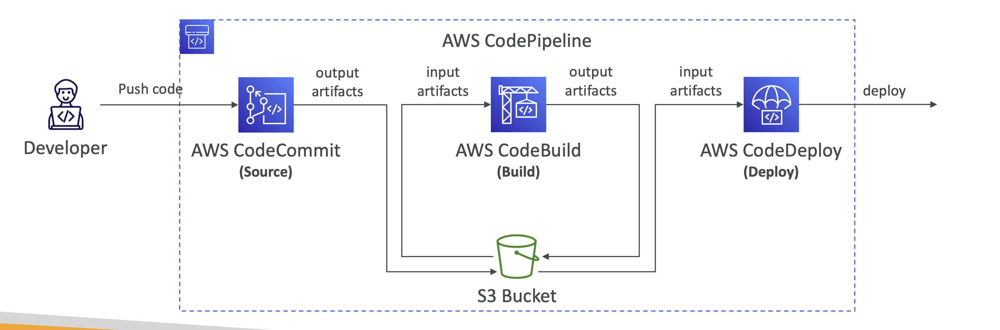

### AWS CI/CD의 흐름과 파이프라인 예시

> AWS에서 CI/CD 파이프라인을 구성하는 일반적인 흐름은 다음과 같다.

1. **코드 작성 및 커밋**:
    - 개발자가 로컬 환경에서 코드를 작성한 후, CodeCommit, GitHub 등의 리포지토리에 커밋한다.

2. **빌드 및 테스트**:
    - 코드가 커밋되면 CodePipeline이 트리거되어 CodeBuild가 소스 코드를 컴파일하고, 유닛 테스트를 수행하며, 결과물을 생성한다.

3. **아티팩트 생성**:
    - 빌드 결과물이 성공적으로 생성되면, 이 아티팩트는 S3나 CodeArtifact에 저장된다.

4. **배포 준비 및 승인**:
    - 테스트를 통과한 후, CodePipeline은 자동으로 배포를 준비한다. 이 단계에서 수동 승인 단계가 포함될 수 있으며, 이는 관리자가 배포 전에 최종 확인을 할 수 있도록 한다.

5. **자동 배포**:
    - CodeDeploy가 트리거되어 EC2 인스턴스, Lambda 함수, ECS 클러스터 등으로 애플리케이션이 배포된다. 블루/그린 배포, 롤링 배포 등 다양한 배포 전략을 사용할 수 있다.

6. **모니터링 및 피드백**:
    - 배포 후 CloudWatch, X-Ray, CodeDeploy 모니터링 도구를 통해 애플리케이션의 성능을 모니터링한다. 문제가 발생하면 자동으로 롤백되거나 알림을 통해 개발자가 즉각 대응할 수 있다.

