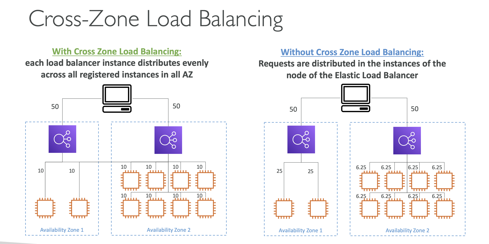

> Cross-Zone Load Balancing 은 Elastic Load Balancer (ELB) 기능의 하나로, 여러 가용성 영역(Availability Zones, AZ)에 걸쳐 있는 인스턴스들 사이에서 트래픽을 고르게 분배하는 기능이다. 이는 로드 밸런서가 단일 가용성 영역에 국한되지 않고 전체 리전 내에서 트래픽을 균일하게 처리할 수 있게 해주어, 어플리케이션의 고가용성과 내결함성을 증대시킨다.

--- 

### 작동 방식
기본적으로 ELB는 요청을 받으면 해당 요청을 로드 밸런서가 위치한 가용성 영역의 인스턴스들에만 분배한다. 하지만 Cross-Zone Load Balancing을 활성화하면, ELB는 모든 가용성 영역의 인스턴스들에 걸쳐 요청을 분배할 수 있다. 이렇게 하면, 한 영역에 인스턴스들이 많아 부하가 덜 한 경우, 다른 영역의 인스턴스들까지도 트래픽을 처리하는 데 동원될 수 있다.

### 주의사항
- 데이터 전송 비용이 발생할 수 있다. AZ 간에 데이터를 전송할 때는 추가 네트워크 비용이 발생할 수 있으므로, 이를 고려하여 로드 밸런싱을 설계해야 한다.
- ALB 의 경우 기본적으로 Cross zone load balancing 이 활성되어 있기 때문에, 데이터가 다른 zone 으로 넘어가도 추가비용이 발생하지 않는다. 반면 NLB 와 GWLB 는 데이터가 다른 가용 zone 으로 넘어가는 경우 추가 비용이 발생한다.)

