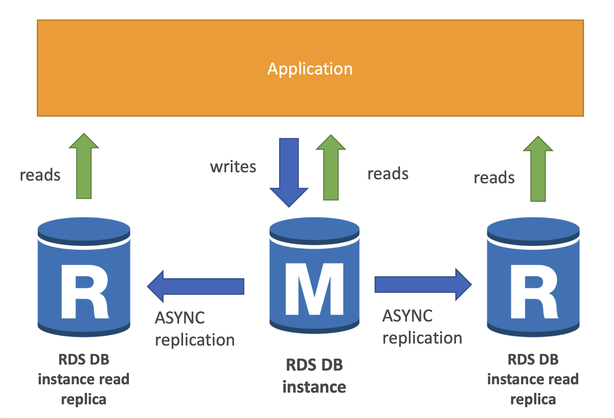

### Read Replica 사용 이유
1. **읽기 성능 향상**

- Read Replica를 사용하면 데이터베이스의 읽기 작업을 분산시켜 주 데이터베이스의 부하를 줄일 수 있으므로 읽기 요청이 많은 애플리케이션에서 성능을 향상시킬 수 있다.

2. **가용성 및 확장성 향상**

- 복제본을 여러 가용 영역 또는 리전에 배포하여, 읽기 작업을 분산하고 가용성을 높일 수 있으며 복제본을 필요에 따라 추가 또는 제거할 수 있어 확장성이 뛰어나다.

3. **백업 및 리포팅 작업 분리**

- 주 데이터베이스의 성능에 영향을 미치지 않도록 백업, 분석, 리포팅 작업을 Read Replica에서 실행할 수 있다.

### 작동 원리 원리
- master RDS 가 있으며, master RDS 에 변경 발생 시 이벤트가 발생하여 replica RDS 에도 변경내용이 비동기로 동기화된다.

### 실제 사용 예시
1. 사용자 수가 많아짐에 따라 데이터베이스의 읽기 요청이 급격히 증가하고, 상품 검색과 조회 기능에서 읽기 성능이 중요시되는 경우 replica 를 적용하여 사용자에게 가장 가까운 read replica 에 읽기요청을 보내 지연시간을 낮춘다.

2. 메인 어플리케이션과, 메인에서 발생되는 데이터를 리포팅하는 어플리케이션이 있다고 가정할 때, 리포팅 시 많은 읽기 쿼리가 발생하여 메인 어플리케이션 성능에 영향을 미치는 경우 리포팅 어플리케이션이 readonly replica 를 바라보게 하여 읽기작업에 대한 부하를 분산시킬 수 있다.

### 주의
- RDS 는 관리형 서비스이므로 replica 가 master 와 같은 region 에만 있다면 다른 AZ 에 배포되더라도 추가비용이 발생하지 않는다. 서로 다른 Region 에 배포되는 경우엔 추가비용이 발생한다.