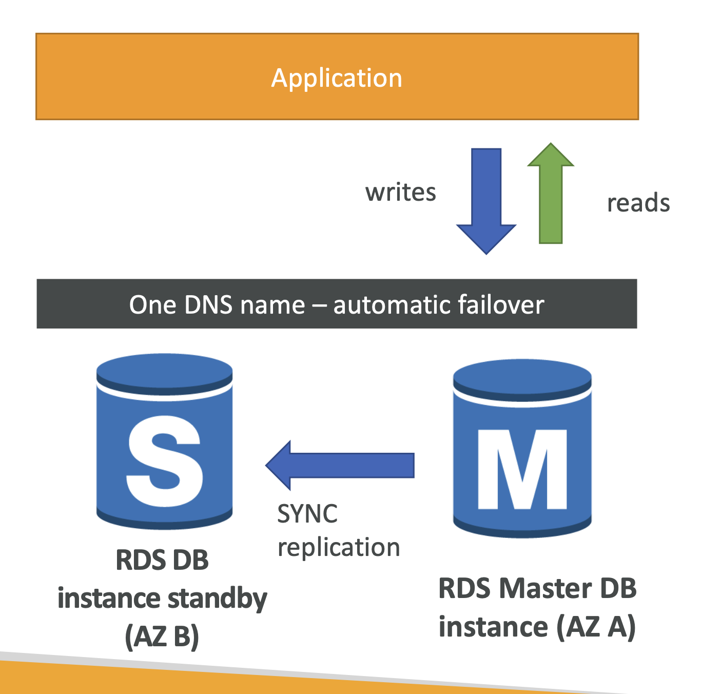
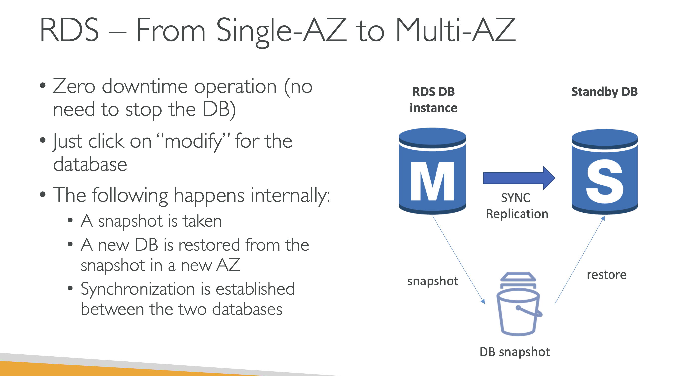

> RDS의 다중 AZ 배포는 고가용성(High Availability)과 데이터 무결성(Data Integrity)을 보장하기 위한 기능이다. 이 기능을 사용하면 데이터베이스 인스턴스와 동기식으로 복제되는 스탠바이 복제본을 다른 가용 영역(AZ: Availability Zone)에 자동으로 생성한다. 주 데이터베이스 인스턴스에 장애가 발생할 경우, 자동으로 스탠바이 복제본으로 페일오버(Failover)되어 서비스 중단 시간을 최소화한다.

### 동작 원리
1. 동기식 복제 
   - 주 데이터베이스 인스턴스의 모든 변경 사항이 스탠바이 복제본에 `동기식`으로 복제된다. 이는 데이터 일관성을 보장하며, 장애 발생 시 최신 데이터로 복구할 수 있다.
   
2. 자동 장애 조치
   - 주 데이터베이스 인스턴스에 장애가 발생하면, AWS RDS는 자동으로 스탠바이 복제본으로 페일오버를 수행한다. 애플리케이션은 새로운 데이터베이스 엔드포인트로 자동으로 전환되며, 대부분의 경우 애플리케이션의 중단 없이 연속적인 서비스가 가능하다.

> 추가로, readonly replica db 서버에 대해서도 다중 AZ 로 설정할 수 있다. 

---

### 단일 AZ -> 멀티 AZ 설정

- 이미 단일 AZ 로 지정된 RDS 를 다중 AZ로 변환하는 과정에서는 downtime 이 필요없다. 먼저 snapshot 을 통해 db 를 복제한 뒤 그 사이에 일어난 변경점을 sync 하여 스탠바이 db 가 master db 와 일치되도록 한다.

--- 

### 읽기전용 RDS 확장과 개념 구분
- 읽기전용 RDS 를 확장하는 것은 읽기 작업을 분산시키기 위함이다.
- 반면 다중 AZ 설정은 (read only 든 아니든 상관 없이)하나의 RDB 서버에 대해 장애가 발생했을 경우를 대비하여, 대상 RDB 서버의 복제품을 하나 더 가지고 있는 것이다.