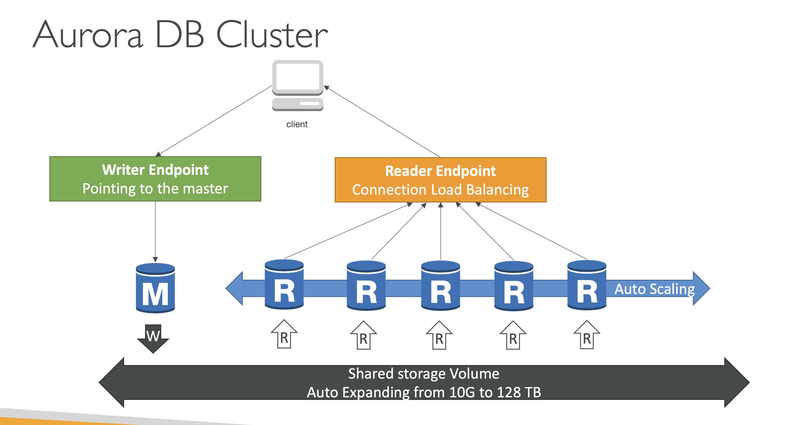
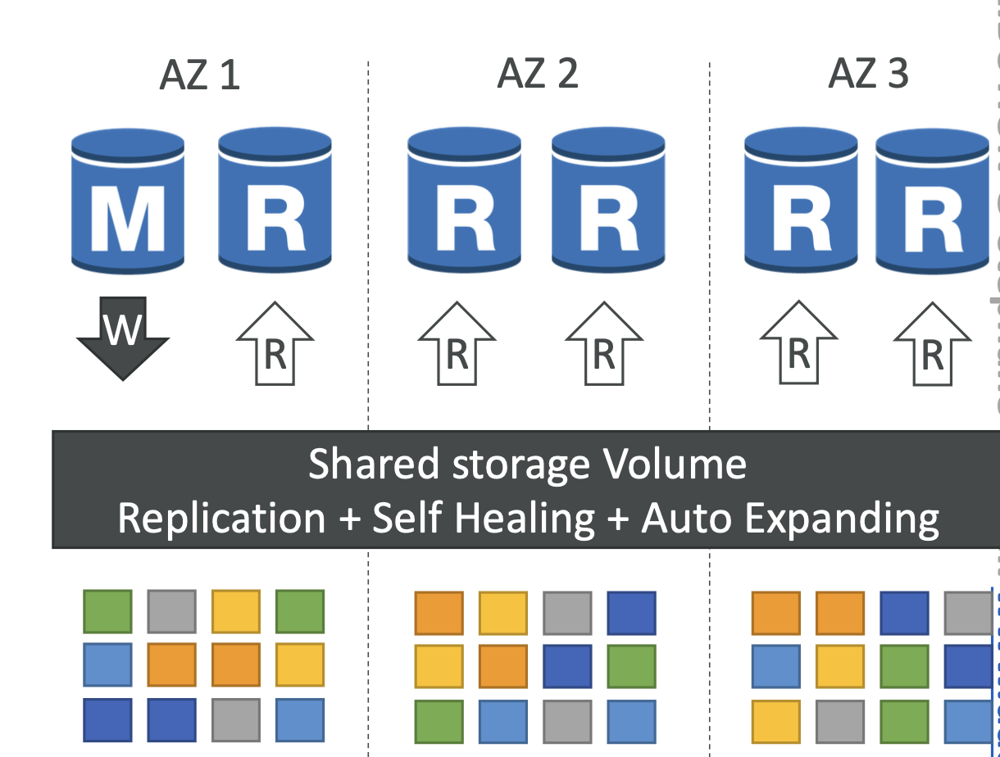

> Aurora 는 AWS 에서 제공하는 고성능 관리형 관계형 데이터베이스 서비스이다. Aurora 는 MySQL 및 PostgreSQL 과 호환된다.

- aurora 인스턴스들은 하나의 논리적인 storage 를 바라본다.

---
### 주요 특징
- 고성능
  - 일반적인 MySQL보다 최대 5배, PostgreSQL보다 최대 3배 빠른 성능을 제공한다.
  

- 고가용성 및 내구성
  - **Multi-AZ 배포**: 여러 가용 영역에 인스턴스를 배포하여 고가용성을 제공한다.
  - **자동 장애 조치**: 인스턴스 장애 시 자동으로 장애 조치가 이루어지며, 새로 생성되는 인스턴스에 대한 동기화가 필요없이 스토리지를 바라보게만 하면 되므로 복구 시간이 짧다.
  - **6 way replication**: 각 데이터는 여러 가용 영역에 걸쳐 스토리지를 6개의 복제본으로 저장하여 내구성을 보장한다. 여러 오로라 인스턴스는 하나의 논리적인 스토리지 계층을 바라보지만, 실제 요청은 6개의 사본에 골고루 분산된다.
    - Multi-AZ 설정은 인스턴스 레벨에서의 Replica 설정이다. Multi-AZ 설정과 관련없이 aurora 는 자동으로 데이터를 6개로 복사하여 저장한다.

- 확장성
  - **자동 스케일링**: Aurora는 자동으로 스토리지 용량을 조정하여, 최대 128TB까지 확장할 수 있다.
  - **리드 리플리카(Read Replica)**: 최대 15개의 리드 리플리카를 생성하여 읽기 성능을 확장할 수 있다(mysql rds 는 최대 5개). 리드 리플리카는 몇 밀리초의 지연으로 데이터 동기화를 유지한다.

- 보안
    - **VPC**: Virtual Private Cloud (VPC)를 통해 네트워크 격리를 지원한다.
    - **암호화**: 데이터는 전송 중 및 저장 시 AWS Key Management Service (KMS)를 사용하여 암호화할 수 있다.
    - **IAM 통합**: AWS Identity and Access Management (IAM)과 통합되어 세밀한 접근 제어를 제공한다.

- 관리 편의성
  - **자동 백업 및 복구**: 자동 백업, 스냅샷, 포인트-인-타임 복구(PITR) 기능을 제공하여 데이터를 보호한다.
  - **서버리스 옵션**: Aurora Serverless 를 통해 자동으로 용량을 조정하여 사용량에 따라 비용을 최적화할 수 있다.

- aurora 스토리지의 데이터는 3개의 가용영역 당 2개의 복제품으로 총 6개의 복제품이 운용된다. 각 복제품은 읽기요청에 사용된다.

---

### 동작 원리
- 스토리지 아키텍처
  - 여러 인스턴스가 하나의 스토리지를 바라본다.
  - 데이터베이스 인스턴스와 스토리지는 분리되어 관리되며, 스토리지 계층은 자동으로 확장 및 축소된다.
  - 하나의 스토리지를 바라보고 있으므로 동기화 과정이 필요없다.

- 성능 최적화
    - Aurora 는 고성능을 위해 다양한 최적화 기술을 사용한다. 예를 들어, 로그 구조화 스토리지 엔진(Log-Structured Storage Engine)을 사용하여 쓰기 성능을 향상시킨다.
    읽기 및 쓰기 작업을 분리하여 동시성 및 성능을 높인다.

