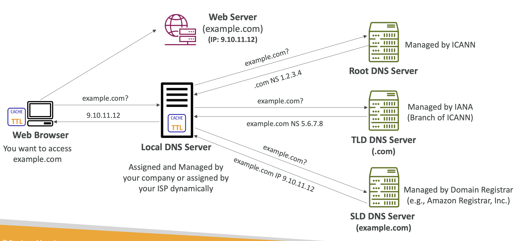

### DNS (Domain Name System)란?
> DNS 는 인터넷에서 도메인 이름과 IP 주소를 서로 변환해 주는 시스템이다. 예를 들어, 사용자가 웹 브라우저에 www.example.com을 입력하면, DNS 는 이 도메인 이름을 서버의 IP 주소 (예: 192.0.2.1)로 변환하여 사용자가 원하는 웹사이트에 접속할 수 있도록 한다.

### 도메인의 계층 구조
도메인 이름은 점으로 구분된 여러 부분으로 구성되며, 이 구조는 계층적이다. 이 계층은 위에서 아래로 다음과 같이 구성된다.

1. **루트 도메인 (Root Domain)**

   - 루트 도메인은 가장 상위 계층으로, 일반적으로 빈 문자열로 표현되며, 점(.)으로 표시된다. 모든 도메인 이름의 끝에 존재하지만 일반적으로 표시되지 않는다.
   - 루트 도메인에는 여러 루트 서버가 있으며, 이들은 최상위 도메인(TLD) 서버에 대한 정보를 가지고 있다.

2. **최상위 도메인 (Top-Level Domain, TLD)**

   - TLD 는 루트 도메인 바로 아래에 위치하며, 일반적으로 com, org, net, edu, gov 와 같은 일반적인 TLD(gTLD)와 kr, jp, fr와 같은 국가 코드 TLD(ccTLD)로 구분된다.
   - 예: com (상업용), org (비영리), kr (대한민국)

3. **2차 도메인 (Second-Level Domain, SLD)**

   - SLD 는 TLD 아래에 위치하며, 도메인 이름의 중간 부분을 차지한다. SLD 는 도메인 소유자가 선택한 이름이다.
   - 예: example.com 에서 example 이 SLD 이다.
     2

4. **하위 도메인 (Subdomain)**

   - 하위 도메인은 SLD 아래에 위치하며, 특정 조직이나 서비스를 위해 도메인을 추가로 세분화할 때 사용된다.
   - 예: www.example.com 에서 www 가 하위 도메인이다. 다른 예로 blog.example.com 이나 mail.example.com 이 있다.

### DNS 의 계층구조와 질의과정

DNS 는 계층적 네트워크로 구성되어 있으며, 각각의 계층이 상위 계층의 정보를 참조한다. 이 계층 구조는 다음과 같이 작동한다.

1. DNS 리졸버 (DNS Resolver)

   - 사용자가 도메인 이름을 입력하면, 이 요청은 먼저 로컬 DNS 리졸버에 도달한다. 이 리졸버는 캐시에 저장된 정보를 사용하여 도메인 이름을 IP 주소로 변환하려고 시도한다.

2. 루트 네임서버 (Root Nameserver)

   - 로컬 리졸버가 캐시에 없는 경우, 루트 네임서버로 요청을 전달한다. 루트 네임서버는 TLD 네임서버의 IP 주소를 제공한다.

3. TLD 네임서버

   - TLD 네임서버는 요청된 도메인의 TLD 에 해당하는 네임서버이다. 예를 들어, example.com 의 경우, .com TLD 네임서버로 요청을 전달한다. 이 네임서버는 해당 도메인의 2차 도메인 네임서버의 IP 주소를 제공한다.

4. 권한 있는 네임서버 (Authoritative Nameserver)

   - 마지막으로, 권한 있는 네임서버가 요청된 도메인의 실제 IP 주소를 반환한다. 예를 들어, example.com 도메인의 네임서버가 실제 IP 주소를 반환한다.

--- 
**아래는 실제 도메인 질의 예시이다.**

1. 도메인 질의 시작
   1. 사용자가 웹 브라우저에 www.example.com을 입력한다.
   2. 웹 브라우저는 DNS 리졸버(DNS Resolver)에 도메인 이름을 질의한다.

2. 로컬 DNS 리졸버
   1. 로컬 리졸버는 먼저 자신의 캐시에서 www.example.com 에 대한 기록이 있는지 확인한다.
   2. 캐시에 해당 도메인의 IP 주소가 있으면, 바로 반환하여 웹 브라우저가 웹사이트에 접속할 수 있도록 한다. 캐시에 없으면 루트 네임서버에 .com 정보를 가진 TLD 서버를 질의한다.

3. 루트 네임서버 질의
   1. 로컬 리졸버는 루트 네임서버에 www.example.com의 TLD(최상위 도메인)인 .com 에 대한 정보를 요청한다.
   2. 루트 네임서버는 .com TLD 네임서버의 주소를 반환한다.

4. TLD 네임서버 질의
   1. 로컬 리졸버는 반환된 .com TLD 네임서버에 example.com 하위 도메인 정보를 알고 있는 SLD 네임서버의 위치를 묻는다.
   2. .com TLD 네임서버는 example.com 도메인에 대한 권한 있는 네임서버의 주소를 반환한다.

5. 권한 있는 네임서버 질의
   1. 로컬 리졸버는 권한 있는 네임서버에 www.example.com 에 대한 정보를 요청한다.
   2. 권한 있는 네임서버는 www.example.com의 실제 IP 주소를 반환한다.

6. IP 주소 반환 및 캐싱
   1. 로컬 리졸버는 반환된 IP 주소를 웹 브라우저에 전달한다.
   2. 이 IP 주소는 로컬 리졸버의 캐시에 일정 시간 동안 저장한다 (TTL 동안).

