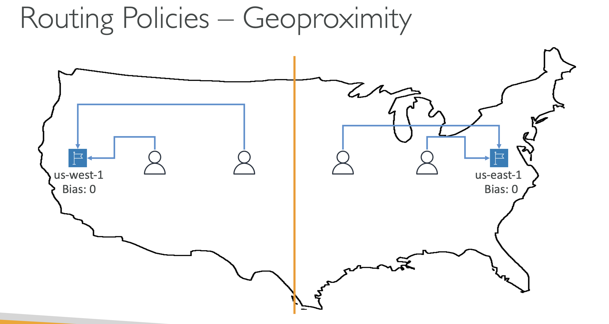
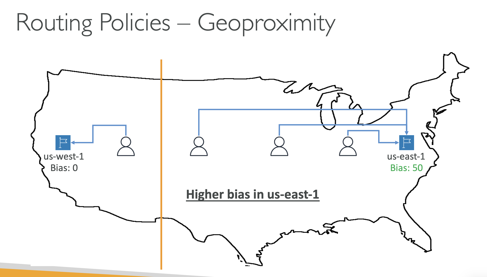
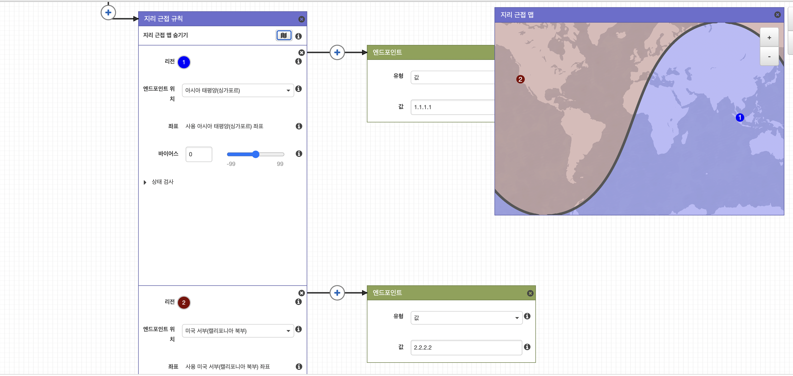
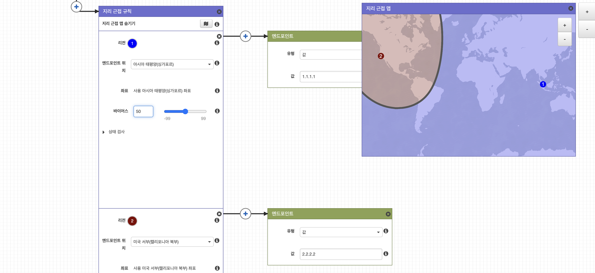

> 특정 지역에서 발생한 traffic 을 가까운 대상에 라우팅한다. 단, 편향값을 설정하여 각 record 가 담당할 지역의 범위를 넓히거나 줄일 수 있다.

- 각 record 의 편향값이 같을 때

- us-east-1 의 record 의 편향값이 같을 때

---

1. 같은 종류의 ec2 두 개를 배포한다.
2. Route53 에서 domain(example.com) 구매 후 해당 도메인에 대한 hosted zone 생성
3. 첫 번쨰 ec2 인스턴스에 대한 A 레코드 등록 (www.example.com)
    - routing policy 를 geoproximity 로 선택, 지역(미국-캘리포니아) 선택 뒤 편향값 지정
4. 두 번쨰 ec2 인스턴스에 대한 A 레코드 등록 (www.example.com)
    - routing policy 를 geoproximity 로 선택, 지역(싱가포르) 선택 뒤 편향값 지정

- 각 record 의 편향값이 같을 때

- 싱가포르 record 의 편향값을 50으로 올림