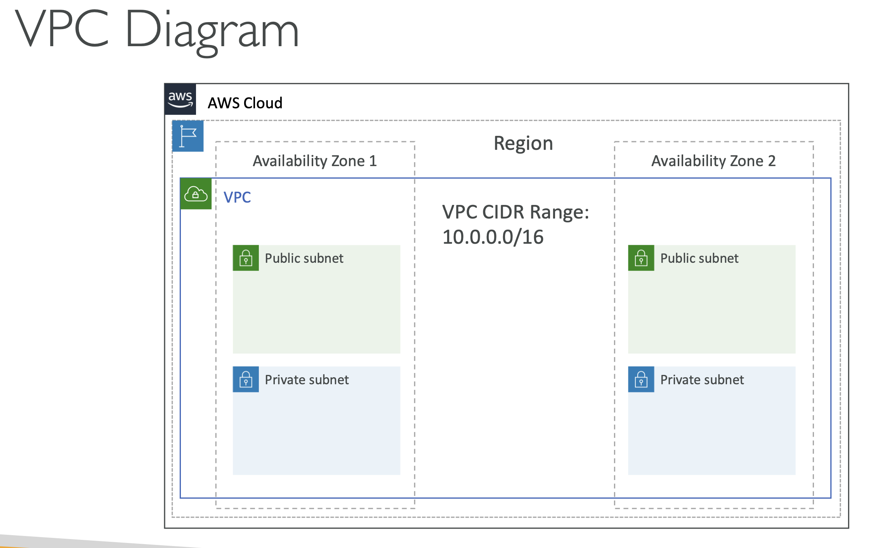
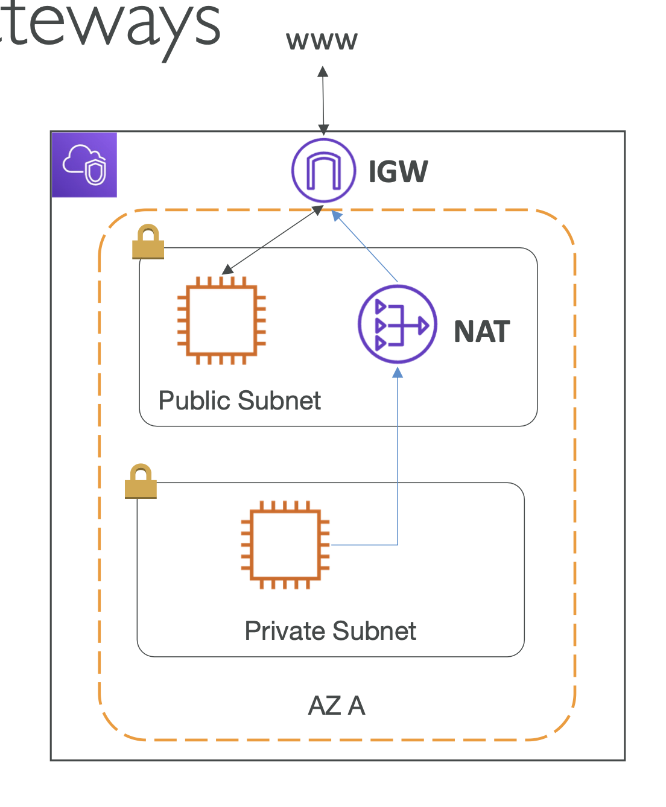

> VPC 는 AWS에서 제공하는 클라우드 자원들을 사용자 정의 네트워크에 배포할 수 있게 하는 서비스이다. VPC 는 사용자에게 클라우드 내에서 격리되고 안전한 네트워크 환경을 제공하며, 사용자 정의 IP 주소 범위, 서브넷, 라우팅 테이블, 인터넷 게이트웨이 등을 설정할 수 있다.

### 주요 구성 요소

1. VPC (Virtual Private Cloud)

   - AWS 리소스를 정의된 네트워크에서 운영할 수 있도록 하는 논리적 격리 네트워크이다. VPC 를 생성할 때 IP 주소 범위를 지정해야 한다(예: 10.0.0.0/16).
   - 다이어그램
     - 

2. 서브넷 (Subnet)

   - VPC 내의 IP 주소 범위를 더 작은 네트워크로 나눈 것이다. 서브넷은 두 가지 유형으로 구분된다.
       - 퍼블릭 서브넷: 인터넷 게이트웨이와 연결되어 있어 외부 인터넷과 통신할 수 있는 서브넷.
       - 프라이빗 서브넷: 인터넷과의 직접 통신이 차단되어 있고, 주로 내부 통신 용도로 사용되는 서브넷.

3. 라우팅 테이블 (Routing Table)

   - 네트워크 트래픽의 방향을 지정하는 규칙 집합이다.
   - 각 서브넷은 라우팅 테이블과 연결되어 있으며, 이를 통해 트래픽이 어디로 향할지 결정한다.

4. 인터넷 게이트웨이 (Internet Gateway)

   -  VPC 내의 인스턴스가 인터넷과 통신할 수 있도록 하는 구성 요소이다. 퍼블릭 서브넷의 인스턴스에 필수적으로 필요한다.

5. NAT 게이트웨이/인스턴스 (NAT Gateway/Instance)

   - 프라이빗 서브넷의 인스턴스가 인터넷에 접근할 수 있게 해주지만, 외부에서 해당 인스턴스로의 직접적인 접근은 불가능하게 한다.
   - 

6. 보안 그룹 (Security Group)

   - VPC 내의 인스턴스에 대한 트래픽을 제어하는 가상 방화벽이다. 인바운드 및 아웃바운드 트래픽 규칙을 설정하여 허용할 트래픽을 지정한다.

7. 네트워크 ACL (Network Access Control List)

   - **서브넷 단위**로 트래픽을 제어하는 방화벽이다. 보안 그룹과 달리 상태 비저장 방식으로 작동하여 인바운드 및 아웃바운드 트래픽 규칙을 별도로 설정한다.

8. VPC 피어링 (VPC Peering)

   - 두 개의 VPC 를 연결하여 서로의 자원에 접근할 수 있도록 하는 기능이다. 동일 리전뿐만 아니라 다른 리전 간에도 피어링 연결을 설정할 수 있다.

### VPC 설계 및 배포 예시
1. **VPC 생성**: 10.0.0.0/16 IP 주소 범위를 갖는 VPC 생성
2. **서브넷 생성**:
   - 퍼블릭 서브넷: 10.0.1.0/24
   - 프라이빗 서브넷: 10.0.2.0/24
3. **인터넷 게이트웨이 연결**: 퍼블릭 서브넷이 인터넷과 통신할 수 있도록 인터넷 게이트웨이 생성 및 연결
4. **라우팅 테이블 설정**:
   - 퍼블릭 서브넷용 라우팅 테이블: 인터넷 게이트웨이로 향하는 경로 추가
   - 프라이빗 서브넷용 라우팅 테이블: NAT 게이트웨이로 향하는 경로 추가
5. **보안 그룹 설정**:
   - 웹 서버용 보안 그룹: HTTP(80), HTTPS(443) 트래픽 허용
   - 데이터베이스 서버용 보안 그룹: 특정 포트(예: MySQL의 3306)만 허용

### VPC 의 강점
- **보안 및 격리**: 네트워크 레벨에서 자원을 격리하고, 사용자 정의 보안 설정을 통해 높은 수준의 보안을 유지할 수 있다.
- **확장성**: 필요에 따라 서브넷 및 IP 주소 범위를 유연하게 조정할 수 있다.
- **유연성**: 온프레미스 네트워크와의 연결, 여러 리전 간의 연결 등 다양한 네트워크 아키텍처를 지원한다.