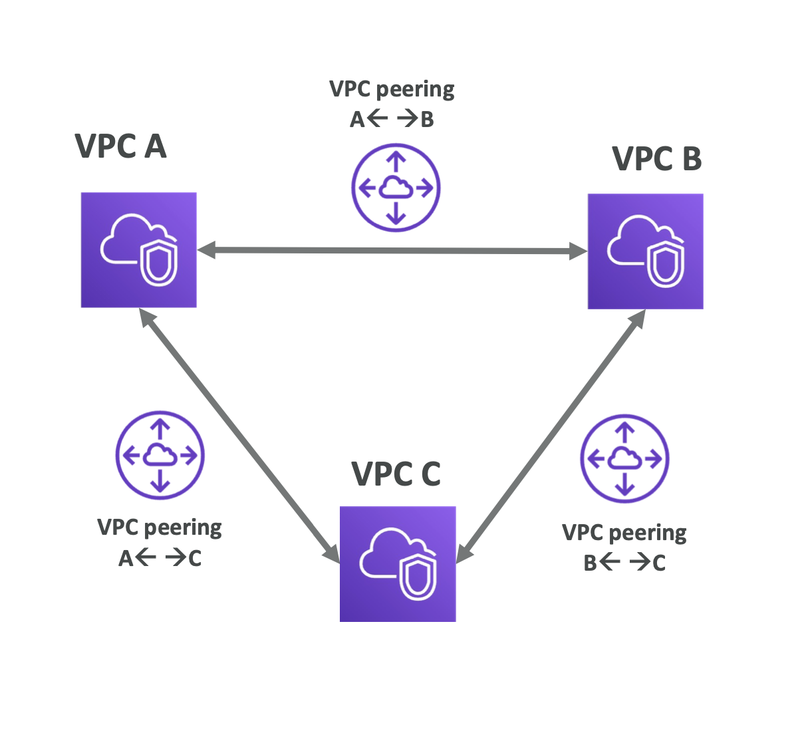
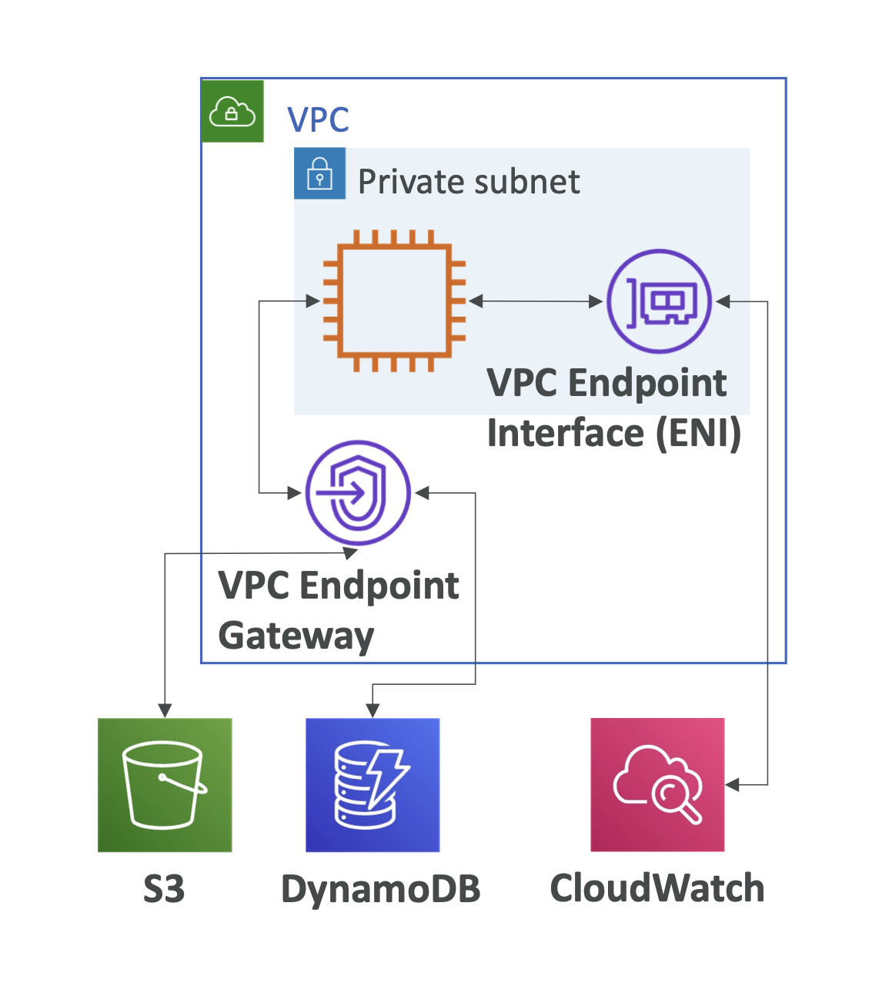
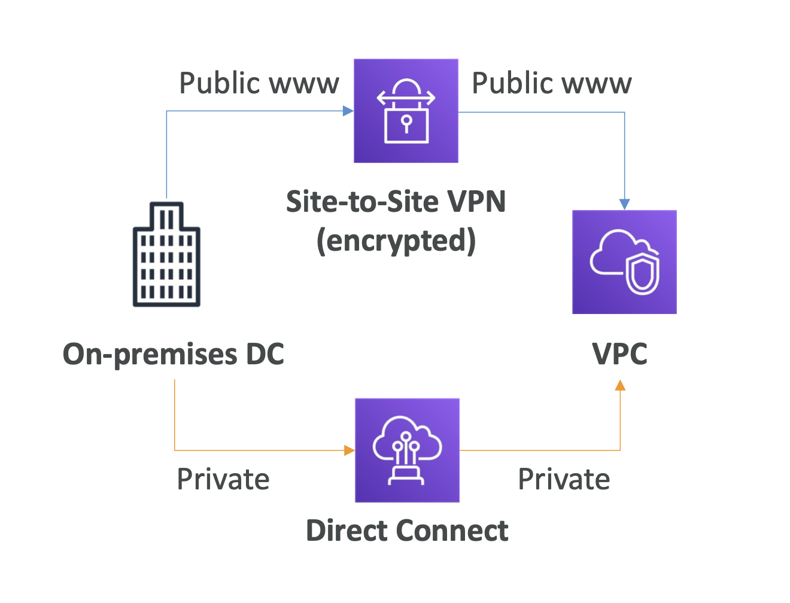

### VPC 피어링

- VPC 피어링은 두 개의 VPC 를 직접 연결하여 서로의 리소스에 접근할 수 있게 하는 네트워킹 기능이다.
- 두 VPC 간의 네트워크 트래픽이 인터넷을 거치지 않고 AWS 네트워크 내부에서 직접 전달된다.
- 통신이 전이되지 않는다. 예로, A와 B VPC 가 서로 연결되어있고, B 와 C VPC 가 연결되어있다고 해서 A와 C가 통신이 가능하진 않다.

### VPC 엔드포인트

- VPC 엔드포인트는 VPC 내에서 특정 AWS 서비스에 대한 프라이빗 연결을 설정하는 네트워킹 기능이다.
- VPC 에서 공개된 aws 인스턴스에 private 하게 접근할 때 사용된다.

### VPN vs Direct Connect
- VPN 은 공개된 인터넷에서 암호화된 통신을, Direct Connect 는 상대와 직접 연결하여 private 한 통신을 이뤄지게 한다.

VPC 피어링
- 

VPC 엔드포인트
- 

VPN vs Direct Connect
- 