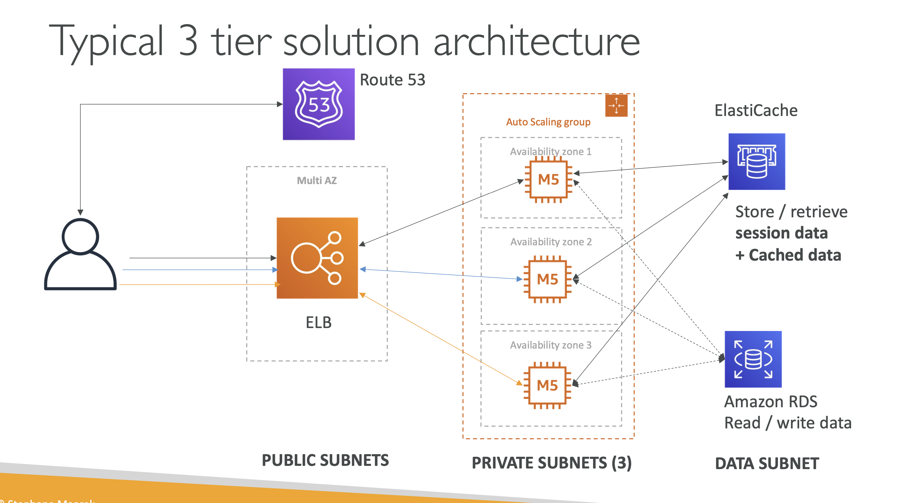
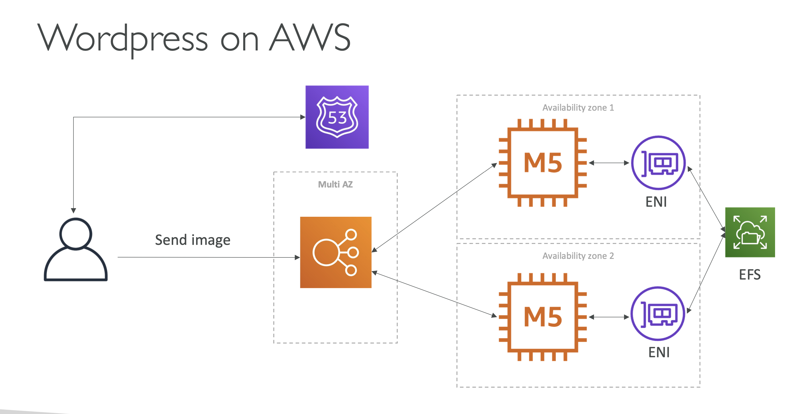
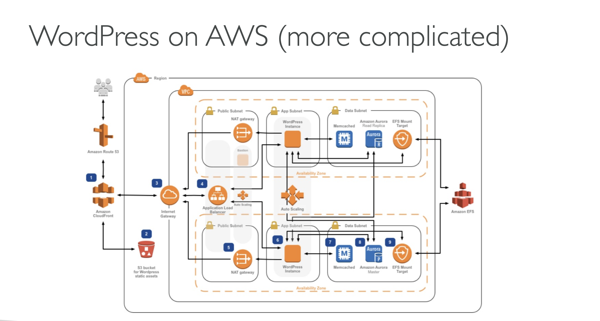

### 3 Tier

- 흐름
  - route 53 에 질의한 ip 로 public subnet 에 요청
  - public subnet 의 ELB 가 같은 vpc 내 private subnet 의 ASG 에 로드밸런싱
  - ec2 는 같은 vpc 내 db 과 직접 통신 
- 같은 VPC 에 있는 오브젝트끼리는 제약없이 통신이 가능하다. 즉, public subnet 에 배포된 ELB 와 private subnet 에 배포된 ASG 는 한 VPC 안에 있기에 통신이 가능하다.

### 2 Tier

### Complicated
